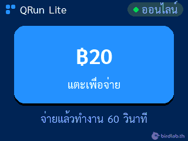
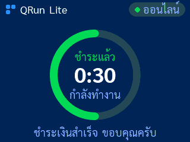
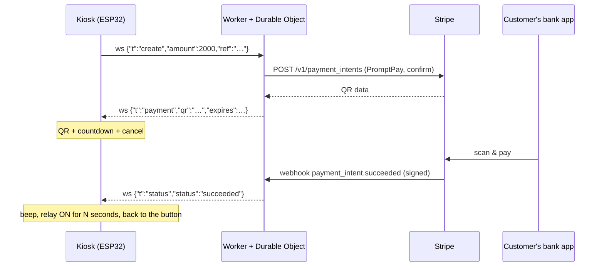
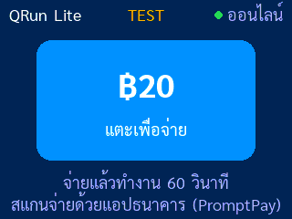
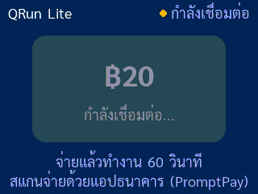
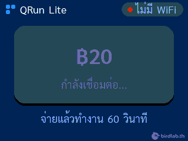

# QRun Lite: scan a QR, the machine runs

> Free, open-source pay-to-run kiosk: a ~$10 ESP32 touch screen, Thai PromptPay QR payments through Stripe, and a
> Cloudflare Worker in between. No Stripe keys on the device.

**English** · [ภาษาไทย](README.th.md)

> **New here? Start with [docs/start-here.en.md](docs/start-here.en.md)**: a step-by-step setup guide for people new to
> Cloudflare, Stripe and the terminal. Every step says what it does and what you should see ([ภาษาไทย](docs/start-here.md)).

The screen shows one price button (default **฿20**). The customer taps it, scans the **PromptPay QR** with any Thai
bank app and pays. The kiosk then switches a **relay** on for a fixed time (default 60 s) with a countdown, and
goes back to the button. A canceled, failed or expired payment shows a short message instead.

QRun Lite is the small, readable edition of **QRun Pro**. See [Lite vs Pro](#lite-vs-pro).

<p align="center">
  
  
  
  
</p>


**Docs:** [Start here (beginners)](docs/start-here.en.md) · [Deploy guide](docs/deploy.en.md) ([ภาษาไทย](docs/deploy.md)) · [Hardware and relay wiring](docs/hardware.md) ·
[Protocol](PROTOCOL.md) · [All screens](#screens)

## How it works



- **No keys on the device.** The ESP32 holds only its own device token. The Stripe key and the webhook secret are
  Cloudflare Worker secrets.
- **The price is set on the server.** The Worker only accepts `PRICE_SATANG`, so a stolen device token can't charge
  other amounts.
- **Push, not polling.** The kiosk keeps a WebSocket open to a Cloudflare Durable Object. Stripe's webhook reaches
  the Worker and the result is pushed to the kiosk straight away.
- **Safe with money.** Webhooks are signature-checked and must match the stored payment. Expired QRs are canceled at
  Stripe, so they can't be paid late. A payment made while the kiosk was offline is picked up when it reconnects.

Wire format: [PROTOCOL.md](PROTOCOL.md).

## Screens

Captured from a real board (320×240). The QR in these pictures is fake preview data.

| | | |
|---|---|---|
| <br>Ready: tap the price | <br>Ready, Stripe test key (**TEST**) | <br>WiFi up, connecting to the Worker |
| <br>No WiFi | <br>Creating the QR | <br>QR + countdown + cancel |
| <br>Last 30 s: amber countdown | <br>Cancel sent | <br>Offline while the QR is shown |
| <br>Paid: relay on, countdown | <br>Canceled | <br>QR expired |
| <br>Payment failed | <br>Error (any cause) | <br>QR in test mode |

| Folder | What |
|---|---|
| [`worker/`](worker/) | Cloudflare Worker + Durable Object (TypeScript, no runtime dependencies) |
| [`firmware/`](firmware/) | PlatformIO / Arduino project for the ESP32-2432S028R ("Cheap Yellow Display") |

## Hardware

- **ESP32-2432S028R** ("CYD", 2.8" ILI9341 display + XPT2046 touch). The on-board speaker beeps.
- A **relay module** (or SSR / MOSFET driver) on **GPIO 22** of the CN1/P3 connector, 3.3 V logic. Power the relay
  coil and the load separately, **not from the CYD's 3.3 V pin** (that resets the board: `BROWNOUT`). Pin and
  polarity: [`firmware/include/config.h`](firmware/include/config.h).
- A 2.4 GHz WiFi network.

Wiring diagram, pins and board variants: [docs/hardware.md](docs/hardware.md).

## Setup (about 10 minutes)

The short version is below. The [step-by-step deploy guide](docs/deploy.en.md) ([ภาษาไทย](docs/deploy.md)) adds
what to expect on the serial log and in `wrangler tail`, going live, maintenance and costs.

You need: a **Stripe account registered in Thailand**, a free **Cloudflare** account, **Node.js 22.12+** and
**PlatformIO** (VS Code extension or `pip install platformio`).

### 1. Stripe
1. In the Stripe Dashboard, go to **Settings → Payment methods** and turn **PromptPay** on.
2. Stay in **test mode** for now. Copy the test secret key (`sk_test_…`) from **Developers → API keys**.

### 2. Settings
- [`worker/wrangler.jsonc`](worker/wrangler.jsonc): set `RECEIPT_EMAIL` to your email (Stripe requires one on
  every PromptPay payment). Change `PRICE_SATANG` if you want a different price (2000 = ฿20, minimum 1000).
  Publishing your fork and don't want your email in it? Leave the placeholder and deploy with
  `npx wrangler deploy --var RECEIPT_EMAIL:you@yourshop.com` instead (every time: a plain `wrangler deploy` puts the
  file's value back).
- [`firmware/include/config.h`](firmware/include/config.h): `PRICE_SATANG` must be **the same number**.
  `RUN_SECONDS` is how long the relay runs.

### 3. Cloudflare Worker
```bash
cd worker                                       # every wrangler command runs in worker/
npm install
npx wrangler login
npx wrangler deploy                             # prints https://qrun-lite.<your-subdomain>.workers.dev
openssl rand -hex 24                            # your device token: keep it for step 5
npx wrangler secret put DEVICE_TOKEN            # paste the token
npx wrangler secret put STRIPE_SECRET_KEY       # paste sk_test_…
```
`secret put` asks for the value only in an interactive terminal. Run from a script, an IDE task or an AI agent's
shell it reads standard input instead, and with nothing piped in it stores an **empty** secret and still prints
`Success!`. There, pipe the value in from the clipboard: `pbpaste | npx wrangler secret put STRIPE_SECRET_KEY`
(macOS; `xclip -o -selection clipboard` on Linux). The Worker refuses to call Stripe with a missing or malformed
key and logs why (see [Troubleshooting](#troubleshooting)).

### 4. Stripe webhook
In the Stripe Dashboard, go to **Developers → Webhooks → Add endpoint**:
- URL: `https://qrun-lite.<your-subdomain>.workers.dev/stripe/webhook`
- Events: `payment_intent.succeeded`, `payment_intent.payment_failed`, `payment_intent.canceled`

Copy the endpoint's signing secret, then:
```bash
npx wrangler secret put STRIPE_WEBHOOK_SECRET   # paste whsec_…
curl https://qrun-lite.<your-subdomain>.workers.dev/health   # → ok
```

### 5. Firmware
```bash
cd firmware
cp include/secrets.h.example include/secrets.h   # WiFi, WS_HOST (the Worker host), DEVICE_TOKEN from step 3
pio run -t upload                                 # add --upload-port /dev/cu.usbserial-XXXX if needed
pio device monitor                                # [WS] connected … < {"t":"hello",…}
```
The screen shows **ออนไลน์** (online) and the price button. Tap it and scan the QR.

### Test mode tip
With a `sk_test_` key the screen shows a yellow **TEST** label. The test QR opens a Stripe test page instead of
charging money: choose **Authorize** (paid, the relay runs) or **Fail**. To go live, create a live key, add the
same webhook endpoint in **live mode** (it has its **own** `whsec_`), and run `wrangler secret put` again for
`STRIPE_SECRET_KEY` and `STRIPE_WEBHOOK_SECRET`. No redeploy or reflash is needed.

Tip: a restricted key (`rk_…`) with only **PaymentIntents: Write** works too, and limits the damage if it leaks.

### Local development (optional)
```bash
cp worker/.dev.vars.example worker/.dev.vars      # test keys only
cd worker && npx wrangler dev --ip 0.0.0.0        # port 8787, reachable from the ESP32
stripe listen --forward-to localhost:8787/stripe/webhook   # prints a whsec_ for .dev.vars
```
In `secrets.h`, set `WS_HOST` to your computer's LAN IP, `WS_PORT 8787` and `WS_USE_TLS 0` (development only: the
token travels unencrypted).

## Troubleshooting

| Symptom | Cause / fix |
|---|---|
| Build error `Missing include/secrets.h` | Copy `include/secrets.h.example` to `include/secrets.h` and fill it in. |
| Header says **ไม่มี WiFi**; serial shows `[WIFI] status=1` or `4` | 1 = network not found (5 GHz-only or a typo), 4 = wrong password. The ESP32 needs 2.4 GHz. |
| Stuck on **กำลังเชื่อมต่อ** (connecting) | Check `WS_HOST` (no `https://`, no path) and `WS_PORT 443`. The Worker log (`npx wrangler tail`) shows `ws auth rejected` if `DEVICE_TOKEN` differs between `secrets.h` and the secret. TLS needs the time: make sure NTP (UDP 123) isn't blocked. |
| Every tap ends in **เกิดข้อผิดพลาด** (error) | `npx wrangler tail`: `amount … != PRICE_SATANG` means the price differs between `config.h` and `wrangler.jsonc`. `PRICE_SATANG is missing` means the var is invalid. `payment provider error (…)`: PromptPay isn't enabled, the account isn't Thai, the key is wrong, or `RECEIPT_EMAIL` is missing. |
| Paid, but the screen changes only when the QR timer runs out | The webhook doesn't arrive. Check the endpoint URL, the three events, and that `STRIPE_WEBHOOK_SECRET` is the secret of **that** endpoint in **that** mode (test and live differ; `stripe listen` has its own). The Dashboard shows failed deliveries. Money is safe: the Worker checks Stripe when the QR expires and when the kiosk reconnects. |
| `server misconfigured` from `/ws` | The `DEVICE_TOKEN` secret isn't set, or it is shorter than 16 characters (`wrangler tail` says which). Use `openssl rand -hex 24`. |
| Every tap ends in **เกิดข้อผิดพลาด**; serial `[ERR] server misconfigured`; tail `STRIPE_SECRET_KEY secret is not set` or `… is not a Stripe secret key` | The Stripe key is missing, empty (see the `secret put` note in step 3) or not a secret key (`pk_…`, `whsec_…`, quotes). Set it again with the full `sk_…`/`rk_…`. The Worker never calls Stripe without a valid-looking key. |
| The board **reboots a few seconds after the relay switches on**; serial shows `[BOOT] reset reason BROWNOUT` | The relay coil pulls the 3.3 V rail down. Power the relay from its own 5 V supply, use a module with a driver and flyback diode: [docs/hardware.md → Power](docs/hardware.md#power-read-this-if-the-board-reboots). |
| Relay works backwards | Set `RELAY_ACTIVE_HIGH = false` in `config.h` (low-trigger relay boards). |
| Touch is off / colours are inverted | Some CYD versions differ. Adjust `touch.setCal(...)` in `firmware/src/hw.cpp` or `TFT_INVERSION_ON` in `platformio.ini`. The 2-USB-port "CYD2USB" uses a different display driver. |
| Worker on a custom domain can't connect over TLS | `firmware/include/root_ca.h` pins the roots Cloudflare uses for `*.workers.dev` (Google Trust Services, Let's Encrypt). Add your certificate's root if it's different. |

## Tests

```bash
cd worker && npm run typecheck && npm test && npm run e2e   # unit tests + end-to-end against a mock Stripe
cd firmware && pio test -e native && pio run               # host tests of the kiosk logic + device build
```
The unit tests cover webhook signatures, the device token check, price enforcement, fail-closed configuration and
every payment state transition. The e2e test runs `wrangler dev` against a local mock Stripe and plays the kiosk
over a real WebSocket: happy path, wrong price, cancel, expiry, payment while offline, bad token, bad or replayed
signature, cancel-then-create, a create replacing a pending QR, a payment racing a cancel, a reboot while a QR is
pending, malformed and oversized frames, and a Worker without its Stripe key. The tests never call real Stripe and
never read your `.dev.vars`. GitHub Actions runs all of it on every push ([ci.yml](.github/workflows/ci.yml)).

## Security notes

- Never put a Stripe key in the firmware: anyone with the board can read its flash.
- The flash does hold your WiFi password and the device token. If a kiosk is stolen, change the token with
  `npx wrangler secret put DEVICE_TOKEN` and reflash your other board.
- The device token is compared in constant time. Webhooks are verified with HMAC-SHA256 over the raw body, with a
  300 s tolerance. Devices never see Stripe's error texts, and the Worker log redacts keys.
- The firmware checks TLS against pinned root certificates. `WS_USE_TLS 0` is for local development only.
- The relay has a hardware timer that switches it off after `RUN_SECONDS`, even if the main loop hangs.

Threat model, residual risks and how to report a vulnerability: [SECURITY.md](SECURITY.md).

## Lite vs Pro

QRun Lite is complete for one kiosk at one price. QRun Pro is the commercial edition for real deployments. These
features are **not in the Lite code** (they were removed, not switched off):

| | QRun Lite (free) | QRun Pro |
|---|---|---|
| Prices | one fixed price | price menu with tiers (e.g. 10 / 20 / 50 ฿), each with its own run time |
| Kiosks | one, with one `DEVICE_TOKEN` | many, one token and one Durable Object per kiosk (`DEVICE_TOKENS` map) |
| Worker design | four plain modules | hexagonal (ports & adapters): swappable payment provider, in-memory fake provider |
| Lost webhooks | checked on reconnect and at QR expiry | also polls Stripe every few seconds while a QR is shown |
| Abuse protection | device token, fixed price, input limits | + per-kiosk payment rate limit, frame-flood protection, throttled re-checks |
| Recovery | best effort: a result is kept until it's sent once; pending payments are re-checked on `hello` | replay of final results with delivery bookkeeping, re-sent creates after a reconnect, cancel while offline, cancel-in-flight handling |
| Screens | simple full-screen redraw, 2 fonts | polished UI: progress ring, urgency colours, partial redraws, snackbar toasts, drawn icons, 6 fonts, RGB LED status |
| Error messages | one generic message | a specific Thai message per cause |
| Sound | one paid beep, one error beep | chimes, last-seconds countdown ticks, "done" chime |
| Tooling | – | `KIOSK_DEBUG` preview and screenshot tool; scripts to import and deploy secrets, point the firmware, run `stripe listen`, switch to test mode |
| Tests | unit, 13 e2e scenarios, native logic tests, CI | + attack e2e suite, firmware ⇄ Worker contract tests, Durable Object eviction tests, kiosk state-machine tests |
| Docs | this README, [PROTOCOL.md](PROTOCOL.md), [architecture diagram](docs/architecture.svg), deploy guide ([EN](docs/deploy.en.md) / [TH](docs/deploy.md)), [hardware notes](docs/hardware.md), [security notes](SECURITY.md) | + architecture write-up for multi-kiosk setups, full security model |

## Get QRun Pro

Need several prices, several kiosks, or a kiosk that recovers from every network glitch on its own? QRun Pro is
available from the author, moomdate. Contact: _[add contact details here]_.

## License

[MIT](LICENSE), © 2026 moomdate. The Sarabun font in `firmware/src/fonts/` is under the
[SIL Open Font License 1.1](firmware/src/fonts/OFL.txt). Third-party components and their licenses:
[THIRD_PARTY_NOTICES.md](THIRD_PARTY_NOTICES.md).
