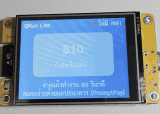
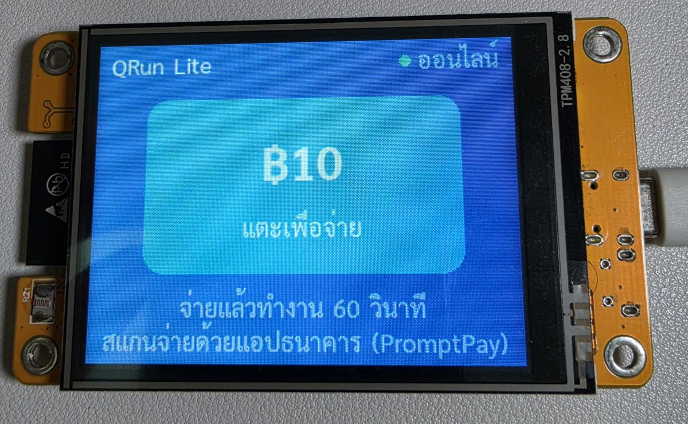
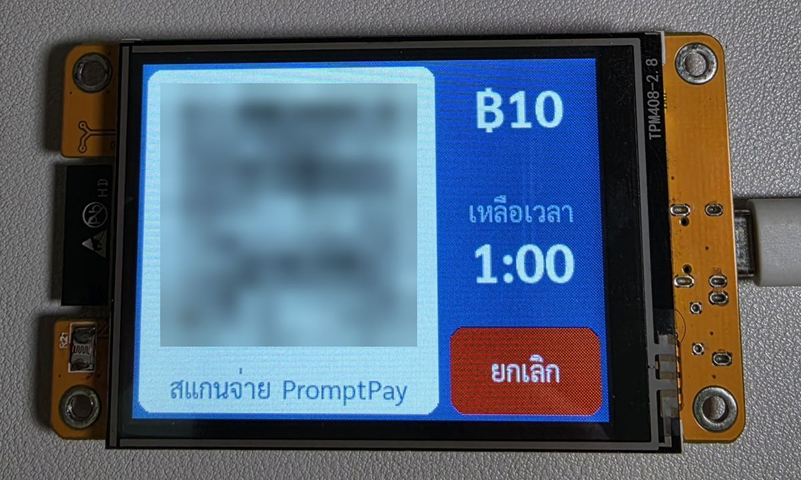
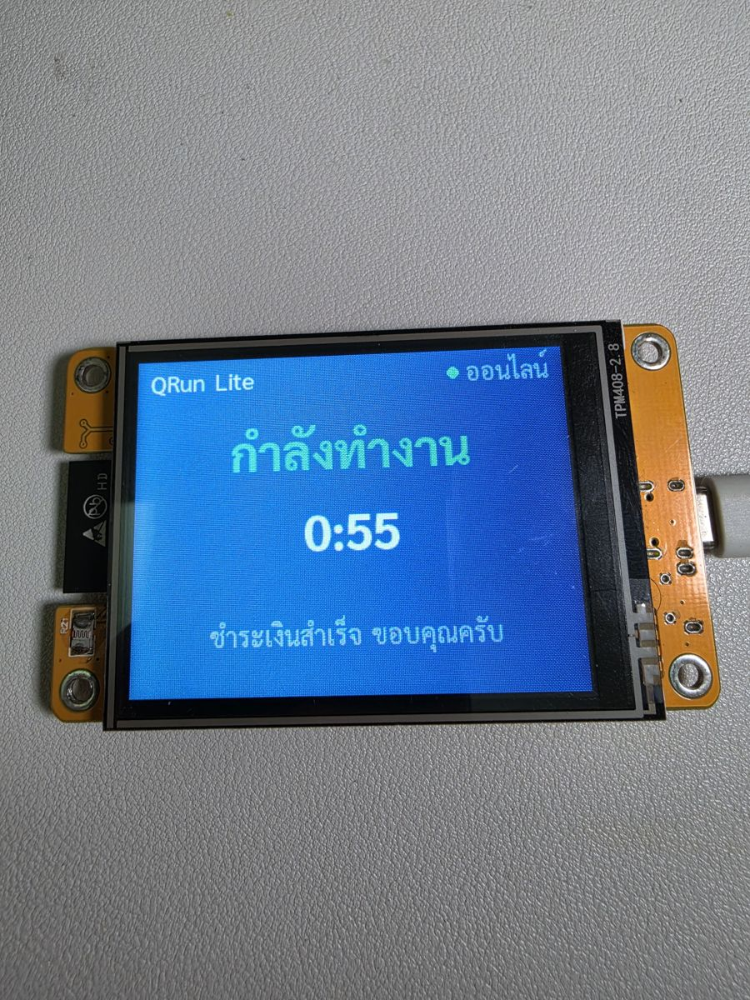
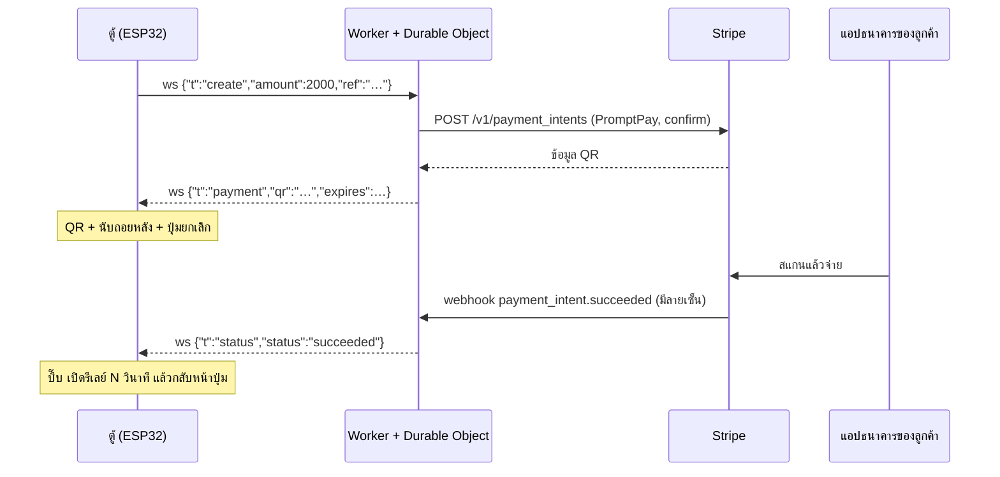
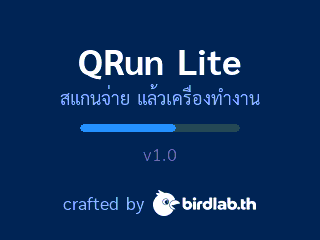

# QRun Lite: สแกน QR แล้วเครื่องทำงาน

> ตู้หยอดเหรียญแบบสแกนจ่าย ฟรีและโอเพนซอร์ส: จอสัมผัส ESP32 ราคาราว 300 บาท + รับเงินผ่าน QR พร้อมเพย์ด้วย Stripe
> โดยมี Cloudflare Worker อยู่ตรงกลาง บนบอร์ดไม่มีคีย์ Stripe เลย

[English](README.md) · **ภาษาไทย**

> **มือใหม่เริ่มที่นี่: [docs/start-here.md](docs/start-here.md)** คู่มือติดตั้งทีละขั้นสำหรับคนที่ไม่เคยใช้ Cloudflare / Stripe / Terminal
> บอกทุกขั้นว่าทำอะไร ทำไม และถ้าสำเร็จจะเห็นอะไร ([English](docs/start-here.en.md))

หน้าจอมีปุ่มราคาเดียว (ค่าเริ่มต้น **฿20**) ลูกค้าแตะปุ่ม สแกน **QR พร้อมเพย์** ด้วยแอปธนาคารไหนก็ได้ แล้วจ่ายเงิน
จากนั้นตู้จะเปิด **รีเลย์** ตามเวลาที่ตั้งไว้ (ค่าเริ่มต้น 60 วินาที) พร้อมนับถอยหลัง แล้วกลับไปหน้าปุ่ม
ถ้ายกเลิก จ่ายไม่สำเร็จ หรือ QR หมดอายุ จะขึ้นข้อความสั้นๆ แทน

QRun Lite คือรุ่นเล็กที่อ่านโค้ดง่ายของ **QRun Pro** ดู [Lite กับ Pro ต่างกันอย่างไร](#lite-กับ-pro-ต่างกันอย่างไร)

<p align="center">
  
</p>
<p align="center">
  
  
  
</p>
<p align="center"><sub>ภาพจากบอร์ด CYD จริง (เบลอ QR ไว้) วิดีโอ: <a href="docs/media/demo-flow.mp4">แตะ → QR → ยกเลิก (11 วิ)</a> ·
<a href="docs/media/demo-running.mp4">นับถอยหลังตอนทำงาน (3 วิ)</a> ภาพหน้าจอทุกสถานะ: <a href="#หน้าจอ">หน้าจอ</a></sub></p>

<p align="center">
  
  
  
  
</p>


**เอกสาร:** [เริ่มที่นี่ (มือใหม่)](docs/start-here.md) · [คู่มือ Deploy](docs/deploy.md) ([English](docs/deploy.en.md)) · [ฮาร์ดแวร์และการต่อรีเลย์](docs/hardware.md) (อังกฤษ) ·
[Protocol](PROTOCOL.md) · [ผู้ให้บริการชำระเงินอื่น](docs/payment-providers.md) (อังกฤษ) · [ร่วมพัฒนา](CONTRIBUTING.md) · [หน้าจอทั้งหมด](#หน้าจอ)

## ทำงานอย่างไร



- **ไม่มีคีย์บนบอร์ด** ESP32 เก็บแค่ device token ของตัวเอง ส่วนคีย์ Stripe และ webhook secret อยู่ใน secret ของ Cloudflare Worker
- **ราคากำหนดที่เซิร์ฟเวอร์** Worker รับเฉพาะยอด `PRICE_SATANG` เท่านั้น ต่อให้ device token หลุด ก็เรียกเก็บยอดอื่นไม่ได้
- **ส่งผลทันที ไม่ต้องคอยถาม** ตู้เปิด WebSocket ค้างไว้กับ Durable Object ของ Cloudflare พอ Stripe ส่ง webhook มาที่ Worker
  ผลก็ถูกส่งต่อไปที่ตู้ทันที
- **ปลอดภัยเรื่องเงิน** ตรวจลายเซ็น webhook ทุกครั้ง และต้องตรงกับรายการที่เก็บไว้ QR ที่หมดอายุจะถูกยกเลิกที่ Stripe
  จึงจ่ายย้อนหลังไม่ได้ ถ้าลูกค้าจ่ายตอนตู้หลุดเน็ต ตู้จะรู้ผลเมื่อต่อกลับมา

รูปแบบข้อความ: [PROTOCOL.md](PROTOCOL.md)

## หน้าจอ

จับภาพจากบอร์ดจริง (320×240) QR ในภาพเป็นข้อมูลตัวอย่าง จ่ายไม่ได้

| | | |
|---|---|---|
| <br>พร้อมใช้: แตะปุ่มราคา | <br>พร้อมใช้ ใช้คีย์ทดสอบ (**TEST**) | <br>ต่อ WiFi แล้ว กำลังต่อ Worker |
| <br>ไม่มี WiFi | <br>กำลังสร้าง QR | <br>QR + นับถอยหลัง + ปุ่มยกเลิก |
| <br>30 วินาทีสุดท้าย: ตัวเลขสีเหลือง | <br>ส่งคำขอยกเลิกแล้ว | <br>หลุดเน็ตระหว่างแสดง QR |
| <br>จ่ายแล้ว: รีเลย์ทำงาน นับถอยหลัง | <br>ยกเลิกแล้ว | <br>QR หมดอายุ |
| <br>จ่ายไม่สำเร็จ | <br>ข้อผิดพลาด (ทุกสาเหตุ) | <br>QR โหมดทดสอบ |
| <br>หน้าเปิดเครื่อง (เครดิต) | | |

| โฟลเดอร์ | คืออะไร |
|---|---|
| [`worker/`](worker/) | Cloudflare Worker + Durable Object (TypeScript ไม่มี runtime dependency) |
| [`firmware/`](firmware/) | โปรเจกต์ PlatformIO / Arduino สำหรับบอร์ด ESP32-2432S028R ("Cheap Yellow Display") |

## ปรับหน้าตา

ทุกอย่างบนหน้าจอตั้งได้ในไฟล์เล็ก ๆ สามไฟล์ใน [`firmware/include/`](firmware/include/) ไม่ต้องแตะโค้ดวาด:

| อยากเปลี่ยน | แก้ไฟล์ |
|---|---|
| ชื่อแบรนด์ ราคา เวลาทำงาน ขารีเลย์ | [`config.h`](firmware/include/config.h) |
| สี | [`theme.h`](firmware/include/theme.h): จอแสดงได้ 256 สี (RGB332) จึงเขียนสีเป็น `rgb332(แดง 0..7, เขียว 0..7, น้ำเงิน 0..3)` แล้วจะขึ้นตรงตามที่เขียน |
| ข้อความทั้งหมด (เช่น แปลภาษา) | [`strings.h`](firmware/include/strings.h): ตารางเดียว ค่าเริ่มต้นเป็นภาษาไทย (ฟอนต์มีแค่ ASCII + ไทย) |
| เลย์เอาต์ หรือเพิ่มหน้าจอ | [`ui.cpp`](firmware/src/ui.cpp): ตำแหน่งปุ่มอยู่บนสุดของไฟล์ แต่ละหน้าจอเป็นฟังก์ชันเล็ก ๆ |

แก้แล้วบิลด์และแฟลชใหม่ (`pio run -t upload`) อย่าเปลี่ยนสี QR ให้ไม่ใช่พื้นขาว/จุดดำ (`QR_BG` / `QR_FG`)

## ฮาร์ดแวร์

- **ESP32-2432S028R** ("CYD" จอ 2.8" ILI9341 + ทัชสกรีน XPT2046) ใช้ลำโพงบนบอร์ดส่งเสียงบี๊บ
- **โมดูลรีเลย์** (หรือ SSR / MOSFET) ต่อที่ **GPIO 22** ของขั้ว CN1/P3 ลอจิก 3.3 V ใช้ไฟเลี้ยงคอยล์รีเลย์และโหลดแยกต่างหาก
  **ห้ามเอาไฟจากขา 3.3 V ของ CYD** (บอร์ดจะรีเซ็ตตัวเอง: `BROWNOUT`) ตั้งขาและขั้วได้ที่
  [`firmware/include/config.h`](firmware/include/config.h)
- WiFi 2.4 GHz

แผนผังการต่อสาย ขาที่ใช้ และรุ่นของบอร์ด: [docs/hardware.md](docs/hardware.md)

## ติดตั้ง (ประมาณ 10 นาที)

ด้านล่างเป็นฉบับย่อ [คู่มือ Deploy ทีละขั้น](docs/deploy.md) มีรายละเอียดเพิ่ม: สิ่งที่ต้องเห็นใน serial และ `wrangler tail`,
การเปิดใช้เงินจริง, งานดูแลประจำ และค่าใช้จ่าย

ต้องมี: **บัญชี Stripe ที่จดในประเทศไทย**, บัญชี **Cloudflare** แบบฟรี, **Node.js 22.12 ขึ้นไป** และ **PlatformIO**
(ส่วนเสริม VS Code หรือ `pip install platformio`)

### 1. Stripe
1. ใน Stripe Dashboard ไปที่ **Settings → Payment methods** แล้วเปิด **PromptPay**
2. ใช้ **โหมดทดสอบ (test mode)** ไปก่อน คัดลอก secret key ของโหมดทดสอบ (`sk_test_…`) จาก **Developers → API keys**

### 2. ตั้งค่า
- [`worker/wrangler.jsonc`](worker/wrangler.jsonc): ใส่อีเมลของคุณที่ `RECEIPT_EMAIL` (Stripe บังคับให้ทุกรายการพร้อมเพย์มีอีเมล)
  เปลี่ยน `PRICE_SATANG` ถ้าต้องการราคาอื่น (หน่วยสตางค์ 2000 = ฿20 ขั้นต่ำ 1000)
  ถ้าจะเผยแพร่ fork ของคุณและไม่อยากให้อีเมลติดไปด้วย ให้คงค่าตัวอย่างไว้แล้ว deploy ด้วย
  `npx wrangler deploy --var RECEIPT_EMAIL:you@yourshop.com` แทน (ต้องใส่ทุกครั้ง เพราะ `wrangler deploy` เฉยๆ จะใช้ค่าในไฟล์)
- [`firmware/include/config.h`](firmware/include/config.h): `PRICE_SATANG` ต้องเป็น **เลขเดียวกัน**
  `RUN_SECONDS` คือเวลาที่รีเลย์ทำงาน

### 3. Cloudflare Worker
```bash
cd worker                                       # คำสั่ง wrangler ทุกคำสั่งต้องรันในโฟลเดอร์ worker/
npm install
npx wrangler login
npx wrangler deploy                             # จะได้ https://qrun-lite.<subdomain>.workers.dev
openssl rand -hex 24                            # device token ของคุณ เก็บไว้ใช้ในขั้นที่ 5
npx wrangler secret put DEVICE_TOKEN            # วาง token
npx wrangler secret put STRIPE_SECRET_KEY       # วาง sk_test_…
```
`secret put` จะถามค่าเฉพาะตอนรันในเทอร์มินัลปกติ ถ้ารันจากสคริปต์ task ของ IDE หรือเชลล์ของ AI agent มันจะอ่านจาก
standard input แทน และถ้าไม่มีอะไรส่งเข้าไป มันจะเก็บ secret **ค่าว่าง** แต่ยังขึ้น `Success!` กรณีนั้นให้ส่งค่าจาก
คลิปบอร์ดเข้าไปตรงๆ: `pbpaste | npx wrangler secret put STRIPE_SECRET_KEY` (macOS; บน Linux ใช้
`xclip -o -selection clipboard`) Worker จะไม่เรียก Stripe ถ้าคีย์ว่างหรือรูปแบบผิด และจะเขียนสาเหตุไว้ใน log
(ดู [แก้ปัญหา](#แก้ปัญหา))

### 4. Stripe webhook
ใน Stripe Dashboard ไปที่ **Developers → Webhooks → Add endpoint**
- URL: `https://qrun-lite.<subdomain>.workers.dev/stripe/webhook`
- Events: `payment_intent.succeeded`, `payment_intent.payment_failed`, `payment_intent.canceled`

คัดลอก signing secret ของ endpoint นั้น แล้ว:
```bash
npx wrangler secret put STRIPE_WEBHOOK_SECRET   # วาง whsec_…
curl https://qrun-lite.<subdomain>.workers.dev/health   # → ok
```

### 5. เฟิร์มแวร์
```bash
cd firmware
cp include/secrets.h.example include/secrets.h   # WiFi, WS_HOST (host ของ Worker), DEVICE_TOKEN จากขั้นที่ 3
pio run -t upload                                 # เพิ่ม --upload-port /dev/cu.usbserial-XXXX ถ้าจำเป็น
pio device monitor                                # [WS] connected … < {"t":"hello",…}
```
หน้าจอจะขึ้น **ออนไลน์** และปุ่มราคา แตะปุ่มแล้วสแกน QR ได้เลย

### เคล็ดลับโหมดทดสอบ
ถ้าใช้คีย์ `sk_test_` หน้าจอจะมีป้าย **TEST** สีเหลือง QR ทดสอบจะเปิดหน้าทดสอบของ Stripe แทนการตัดเงินจริง
กด **Authorize** (จ่ายสำเร็จ รีเลย์ทำงาน) หรือ **Fail** ก็ได้ เมื่อจะใช้งานจริง ให้สร้าง live key แล้วเพิ่ม webhook endpoint
เดิมใน **live mode** (ซึ่งมี `whsec_` **ของตัวเอง**) จากนั้นรัน `wrangler secret put` ใหม่สำหรับ `STRIPE_SECRET_KEY`
และ `STRIPE_WEBHOOK_SECRET` ไม่ต้อง deploy หรือแฟลชบอร์ดใหม่

เคล็ดลับ: ใช้ restricted key (`rk_…`) ที่ให้สิทธิ์แค่ **PaymentIntents: Write** ก็ได้ ถ้าคีย์หลุดความเสียหายจะน้อยกว่า

### พัฒนาในเครื่อง (ไม่บังคับ)
```bash
cp worker/.dev.vars.example worker/.dev.vars      # ใช้คีย์ทดสอบเท่านั้น
cd worker && npx wrangler dev --ip 0.0.0.0        # พอร์ต 8787 ให้ ESP32 เข้าถึงได้
stripe listen --forward-to localhost:8787/stripe/webhook   # จะแสดง whsec_ สำหรับใส่ใน .dev.vars
```
ใน `secrets.h` ตั้ง `WS_HOST` เป็น IP ในวง LAN ของคอมพิวเตอร์, `WS_PORT 8787` และ `WS_USE_TLS 0`
(ใช้ตอนพัฒนาเท่านั้น เพราะ token จะวิ่งแบบไม่เข้ารหัส)

## แก้ปัญหา

| อาการ | สาเหตุ / วิธีแก้ |
|---|---|
| คอมไพล์แล้วขึ้น `Missing include/secrets.h` | คัดลอก `include/secrets.h.example` เป็น `include/secrets.h` แล้วกรอกข้อมูล |
| หัวจอขึ้น **ไม่มี WiFi** และ serial ขึ้น `[WIFI] status=1` หรือ `4` | 1 = หาเครือข่ายไม่เจอ (เป็น 5 GHz อย่างเดียว หรือพิมพ์ชื่อผิด), 4 = รหัสผ่านผิด ESP32 ใช้ได้แค่ 2.4 GHz |
| ค้างที่ **กำลังเชื่อมต่อ** | ตรวจ `WS_HOST` (ไม่มี `https://` ไม่มี path) และ `WS_PORT 443` ถ้า `DEVICE_TOKEN` ใน `secrets.h` ไม่ตรงกับ secret จะเห็น `ws auth rejected` ใน log ของ Worker (`npx wrangler tail`) TLS ต้องใช้เวลาที่ถูกต้อง ตรวจว่าเครือข่ายไม่บล็อก NTP (UDP 123) |
| แตะทีไรขึ้น **เกิดข้อผิดพลาด** ทุกครั้ง | ดู `npx wrangler tail`: ถ้าเจอ `amount … != PRICE_SATANG` แปลว่าราคาใน `config.h` กับ `wrangler.jsonc` ไม่ตรงกัน ถ้าเจอ `PRICE_SATANG is missing` แปลว่าค่าไม่ถูกต้อง ถ้าเจอ `payment provider error (…)` แปลว่ายังไม่เปิด PromptPay, บัญชีไม่ใช่ของไทย, คีย์ผิด หรือไม่มี `RECEIPT_EMAIL` |
| จ่ายแล้ว แต่หน้าจอเปลี่ยนตอนเวลา QR หมดเท่านั้น | webhook มาไม่ถึง ตรวจ URL ของ endpoint, events ทั้งสาม และ `STRIPE_WEBHOOK_SECRET` ต้องเป็น secret ของ endpoint **นั้น** ใน **โหมดนั้น** (test กับ live ไม่เหมือนกัน และ `stripe listen` ก็มีของตัวเอง) ดูการส่งที่ล้มเหลวได้ใน Dashboard เงินไม่หาย เพราะ Worker จะถาม Stripe ตอน QR หมดอายุและตอนตู้ต่อกลับมา |
| `/ws` ตอบ `server misconfigured` | ยังไม่ได้ตั้ง secret `DEVICE_TOKEN` หรือสั้นกว่า 16 ตัวอักษร (`wrangler tail` บอกว่าเป็นกรณีไหน) ใช้ `openssl rand -hex 24` |
| แตะทีไรขึ้น **เกิดข้อผิดพลาด**; serial ขึ้น `[ERR] server misconfigured`; tail ขึ้น `STRIPE_SECRET_KEY secret is not set` หรือ `… is not a Stripe secret key` | คีย์ Stripe ไม่ได้ตั้ง เป็นค่าว่าง (ดูหมายเหตุ `secret put` ในขั้นที่ 3) หรือไม่ใช่ secret key (`pk_…`, `whsec_…`, มีเครื่องหมายคำพูด) ตั้งใหม่ด้วย `sk_…`/`rk_…` ให้ครบทั้งตัว Worker จะไม่เรียก Stripe ถ้าคีย์ดูไม่ถูกต้อง |
| **บอร์ดรีบูตหลังรีเลย์ติดไม่กี่วินาที**; serial ขึ้น `[BOOT] reset reason BROWNOUT` | คอยล์รีเลย์ดึงไฟ 3.3 V จนตก ให้จ่ายไฟรีเลย์จากแหล่ง 5 V แยก และใช้โมดูลที่มีวงจรขับกับไดโอดกันไฟย้อน: [docs/hardware.md → Power](docs/hardware.md#power-read-this-if-the-board-reboots) |
| รีเลย์ทำงานกลับด้าน | ตั้ง `RELAY_ACTIVE_HIGH = false` ใน `config.h` (บอร์ดรีเลย์แบบ low-trigger) |
| แตะไม่ตรง / สีเพี้ยนกลับด้าน | บอร์ด CYD บางรุ่นต่างกัน ปรับค่า calibrate touch (`X_MIN`…`Y_MAX`) ใน `firmware/src/hw.cpp` บอร์ดรุ่นเก่าบางตัวต้องเปิด `-D TFT_INVERSION_ON=1` ใน `platformio.ini` รุ่น "CYD2USB" (มีพอร์ต USB 2 ช่อง) ใช้ไดรเวอร์จอคนละตัว |
| ใช้ Worker กับโดเมนของตัวเองแล้วต่อ TLS ไม่ได้ | `firmware/include/root_ca.h` ปักหมุด root CA ที่ Cloudflare ใช้กับ `*.workers.dev` (Google Trust Services, Let's Encrypt) ถ้าใบรับรองของคุณใช้ root อื่นให้เพิ่มเข้าไป |

## ทดสอบ

```bash
cd worker && npm run typecheck && npm test && npm run e2e   # unit test + end-to-end กับ Stripe จำลอง
cd firmware && pio test -e native && pio run               # ทดสอบลอจิกของตู้บนคอมพิวเตอร์ + build สำหรับบอร์ด
```
unit test ครอบคลุมการตรวจลายเซ็น webhook, การตรวจ device token, การบังคับราคา, การปฏิเสธเมื่อตั้งค่าผิด (fail closed)
และการเปลี่ยนสถานะการจ่ายเงินทุกแบบ ส่วน e2e จะรัน `wrangler dev` กับ Stripe จำลองในเครื่อง และเล่นเป็นตู้ผ่าน WebSocket จริง:
จ่ายสำเร็จ, ราคาผิด, ยกเลิก, หมดอายุ, จ่ายตอนตู้หลุดเน็ต, token ผิด, ลายเซ็นผิดหรือถูกส่งซ้ำ, ยกเลิกแล้วสร้างใหม่ทันที,
สร้างใหม่ทับ QR ที่ค้าง, จ่ายเงินชนกับการยกเลิก, บอร์ดรีบูตระหว่างมี QR ค้าง, เฟรมเสียหรือใหญ่เกิน และ Worker ที่ไม่มีคีย์ Stripe
การทดสอบไม่เรียก Stripe จริงและไม่อ่าน `.dev.vars` ของคุณ GitHub Actions รันทั้งหมดทุกครั้งที่ push
([ci.yml](.github/workflows/ci.yml))

## เรื่องความปลอดภัย

- ห้ามใส่คีย์ Stripe ในเฟิร์มแวร์ เพราะใครได้บอร์ดไปก็อ่าน flash ได้
- ใน flash มีรหัส WiFi และ device token อยู่ ถ้าตู้ถูกขโมย ให้เปลี่ยน token ด้วย `npx wrangler secret put DEVICE_TOKEN`
  แล้วแฟลชบอร์ดใหม่ของคุณ
- ตรวจ device token แบบ constant-time ตรวจ webhook ด้วย HMAC-SHA256 บน body ดิบ คลาดเคลื่อนได้ไม่เกิน 300 วินาที
  ตู้ไม่เคยเห็นข้อความ error ของ Stripe และ log ของ Worker จะปิดบังคีย์ไว้
- เฟิร์มแวร์ตรวจ TLS กับ root certificate ที่ปักหมุดไว้ `WS_USE_TLS 0` ใช้ตอนพัฒนาเท่านั้น
- รีเลย์มีตัวจับเวลาฮาร์ดแวร์ที่ปิดรีเลย์เมื่อครบ `RUN_SECONDS` แม้ลูปหลักจะค้าง

โมเดลภัยคุกคาม ความเสี่ยงที่ยังเหลือ และวิธีแจ้งช่องโหว่: [SECURITY.md](SECURITY.md)

## Lite กับ Pro ต่างกันอย่างไร

QRun Lite ใช้งานได้ครบสำหรับตู้เดียวราคาเดียว ส่วน QRun Pro เป็นรุ่นเชิงพาณิชย์สำหรับติดตั้งใช้งานจริง
ฟีเจอร์ด้านล่าง **ไม่มีอยู่ในโค้ด Lite** (ตัดออกไปแล้ว ไม่ได้แค่ปิดไว้)

| | QRun Lite (ฟรี) | QRun Pro |
|---|---|---|
| ราคา | ราคาเดียว | เมนูหลายราคา (เช่น 10 / 20 / 50 ฿) แต่ละราคามีเวลาทำงานของตัวเอง |
| จำนวนตู้ | ตู้เดียว `DEVICE_TOKEN` เดียว | หลายตู้ แต่ละตู้มี token และ Durable Object ของตัวเอง (`DEVICE_TOKENS`) |
| โครงสร้าง Worker | โมดูลธรรมดา 4 ไฟล์ | แบบ hexagonal (ports & adapters) เปลี่ยนผู้ให้บริการชำระเงินได้ มี fake provider |
| webhook หาย | ตรวจตอนต่อกลับและตอน QR หมดอายุ | ถาม Stripe ทุกไม่กี่วินาทีระหว่างแสดง QR ด้วย |
| กันการใช้ผิดวัตถุประสงค์ | device token, ราคาตายตัว, จำกัดขนาดข้อมูล | + จำกัดจำนวนรายการต่อตู้, กันข้อความท่วม, จำกัดความถี่การตรวจซ้ำ |
| การกู้คืน | พยายามเท่าที่ทำได้: เก็บผลไว้จนส่งได้หนึ่งครั้ง และตรวจรายการค้างตอน `hello` | ส่งผลซ้ำพร้อมบันทึกการส่ง, ส่ง create ซ้ำหลังต่อกลับ, ยกเลิกตอนออฟไลน์, จัดการยกเลิกที่ค้างอยู่ |
| หน้าจอ | วาดใหม่ทั้งจอ ใช้ 2 ฟอนต์ | UI สวยกว่า: วงแหวนนับถอยหลัง, สีเตือนใกล้หมดเวลา, วาดเฉพาะส่วน, แจ้งเตือนแบบ toast, ไอคอน, 6 ฟอนต์, ไฟ LED บอกสถานะ |
| ข้อความ error | ข้อความเดียว | ข้อความภาษาไทยเฉพาะแต่ละสาเหตุ |
| เสียง | บี๊บตอนจ่ายสำเร็จ และบี๊บตอนผิดพลาด | เสียงเพลง, เสียงนับถอยหลังวินาทีสุดท้าย, เสียงจบงาน |
| เครื่องมือ | – | โหมด `KIOSK_DEBUG` สำหรับพรีวิวและจับภาพหน้าจอ, สคริปต์นำเข้าและ deploy secret, ชี้เฟิร์มแวร์, รัน `stripe listen`, สลับโหมดทดสอบ |
| การทดสอบ | unit, e2e 13 กรณี, ทดสอบลอจิกบนคอมพิวเตอร์, CI | + ชุด e2e จำลองการโจมตี, contract test ระหว่างเฟิร์มแวร์กับ Worker, ทดสอบ Durable Object ถูก evict, ทดสอบ state machine ของตู้ |
| เอกสาร | README นี้, [PROTOCOL.md](PROTOCOL.md), [แผนภาพ](docs/architecture.svg), คู่มือ deploy ([TH](docs/deploy.md) / [EN](docs/deploy.en.md)), [ฮาร์ดแวร์](docs/hardware.md), [ความปลอดภัย](SECURITY.md) | + เอกสารสถาปัตยกรรมสำหรับหลายตู้, โมเดลความปลอดภัยฉบับเต็ม |

## รับ QRun Pro

ต้องการหลายราคา หลายตู้ หรือตู้ที่กู้คืนตัวเองได้ทุกครั้งที่เน็ตสะดุด? ติดต่อผู้พัฒนา (moomdate) ได้ที่:
เปิด issue หรือติดต่อ [@moomdate](https://github.com/moomdate) บน GitHub

## สัญญาอนุญาต

[MIT](LICENSE) © 2026 moomdate ฟอนต์ Sarabun ใน `firmware/src/fonts/` ใช้สัญญาอนุญาต
[SIL Open Font License 1.1](firmware/src/fonts/OFL.txt) ส่วนประกอบของบุคคลที่สามและสัญญาอนุญาต:
[THIRD_PARTY_NOTICES.md](THIRD_PARTY_NOTICES.md)

โลโก้ birdlab.th และเครดิตบนหน้าจอตอนเปิดเครื่องเป็นแบรนด์ของผู้เขียน ไม่อยู่ใต้ MIT โปรดคงไว้เมื่อแจกจ่าย QRun Lite
ดู [NOTICE](NOTICE)
