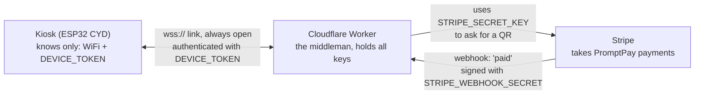

# Start here: QRun Lite setup for beginners

**English** · [ภาษาไทย](start-here.md)

This guide is for people who can flash an ESP32 but are new to Cloudflare, Stripe and the terminal. Every step says
**what you do and why, what to type, and what you should see when it worked**, so you always know whether a step passed.

Short version for experienced users: [deploy.en.md](deploy.en.md) · Relay wiring: [hardware.md](hardware.md)

> [!TIP]
> **Already done part of it?** Jump to the first step you haven't done.
>
> | Done | Continue at |
> |---|---|
> | Nothing yet | [What you need](#3-what-you-need) |
> | `wrangler deploy` done and `/health` answers `ok` | [Step 5: set the first two secrets](#step-5-set-the-first-two-secrets) |
> | Deployed + all 3 secrets set | [Step 7: point the firmware at the Worker and flash](#step-7-point-the-firmware-at-the-worker-and-flash) |
> | Flashed, screen shows **ออนไลน์** (online) | [Check that everything works](#5-check-that-everything-works) |

## Contents

1. [The big picture in 1 minute](#1-the-big-picture-in-1-minute)
2. [Words you need](#2-words-you-need)
3. [What you need](#3-what-you-need)
4. [Step by step](#4-step-by-step) (steps 1–8)
5. [Check that everything works](#5-check-that-everything-works)
6. [Switching from test to real money](#6-switching-from-test-to-real-money) and [Never do this](#never-do-this)
7. [Common problems](#7-common-problems)

---

## 1. The big picture in 1 minute

Three pieces talk to each other:



As a story:

1. A customer taps the price button. The kiosk tells the Worker "I need a ฿20 QR".
2. The Worker uses the Stripe key to create a PromptPay QR and sends it back to the kiosk.
3. The customer scans and pays. Stripe sends a message (a webhook) to the Worker: "paid".
4. The Worker forwards it to the kiosk at once. The kiosk beeps and switches the relay on for the set time.

**Why a Worker in the middle?** So the Stripe key never lives on the board. If someone steals the kiosk, the key
stays safe. The board only holds the WiFi password and its own device password.

### The 3 secrets

| Name | Think of it as | Where it lives |
|---|---|---|
| `DEVICE_TOKEN` | **The kiosk's password.** The kiosk uses it to tell the Worker "I'm this shop's kiosk". Kiosk and Worker must hold the exact same value. | Worker **and** `firmware/include/secrets.h` |
| `STRIPE_SECRET_KEY` | **The key to your Stripe account.** Whoever has it can create charges in your shop's name. | Worker only. Never on the board. |
| `STRIPE_WEBHOOK_SECRET` | **Stripe's signature.** The Worker uses it to check that a "paid" message really comes from Stripe. | Worker only |

Besides secrets there are **plain settings** (not secret) in files, like the price `PRICE_SATANG` and your shop
email `RECEIPT_EMAIL`.

---

## 2. Words you need

| Word | Meaning |
|---|---|
| **Terminal** | The app where you type commands. On a Mac: Spotlight (⌘ Space), type `Terminal`. The Terminal tab in VS Code works too. Type a command, press Enter. |
| **Current folder (cd)** | The terminal always works inside one folder. `cd name` goes into a folder, `pwd` shows where you are. This guide always says which folder to be in. |
| **wrangler** | Cloudflare's command-line tool for Workers. We run it as `npx wrangler …` (`npx` runs a tool installed in the project). |
| **Worker** | A small program running on Cloudflare's servers 24/7. Your computer can be off. |
| **deploy** | Upload the Worker code to Cloudflare and start it (like flashing, but to the cloud). |
| **secret** | A private value stored in Cloudflare. Once set, **it can't be read back**, only overwritten. If you forget it, make a new one and set it again. |
| **webhook** | Stripe "calling back" the Worker when something happens, e.g. a payment succeeded. You tell Stripe which URL to call. |
| **whsec** | A value starting with `whsec_`: the signing secret of one webhook endpoint. Each endpoint has its own. They are not interchangeable. |
| **test mode / live mode** | Stripe has two separate worlds. **Test** = fake money for trying things, keys start with `sk_test_`. **Live** = real money, keys start with `sk_live_`. Keys, webhooks and payments of the two never mix. |
| **workers.dev URL** | The free web address Cloudflare gives your Worker, e.g. `https://qrun-lite.somchai.workers.dev` (`somchai` is your account's subdomain). |
| **host** | Only the name part of a URL: no `https://`, no trailing `/`, e.g. `qrun-lite.somchai.workers.dev`. |
| **flash** | Compile the firmware and write it to the ESP32 over USB. |
| **serial monitor** | A window showing the text the board prints over USB. Use it to see whether the board joined WiFi and reached the Worker. |
| **port** | The name of the USB connection the board is on. On a Mac it looks like `/dev/cu.usbserial-1420`. |

---

## 3. What you need

Tick each item. Each one says how to check you really have it.

- [ ] **Node.js 22.12 or newer** (runs wrangler)
  Check: `node -v` shows `v22.12` or higher (wrangler and vitest need it). If you get `command not found`, install the LTS from https://nodejs.org.
- [ ] **PlatformIO** (flashes the board; the VS Code extension is fine)
  Check: `~/.platformio/penv/bin/pio --version` shows `PlatformIO Core, version 6.x.x`.
- [ ] **A Cloudflare account** (free at https://dash.cloudflare.com)
  Check: in step 3 with `npx wrangler login` and `npx wrangler whoami`.
- [ ] **A Stripe account registered in Thailand, with PromptPay on**
  Check: Stripe Dashboard → **Settings → Business details** says Thailand, and **Settings → Payment methods** shows
  **PromptPay** enabled (if not, do it in step 1).
- [ ] **An ESP32-2432S028R (CYD) board + a USB cable that carries data** (charge-only cables don't work)
  Check: plug it in, run `ls /dev/cu.usbserial-*`, you see at least one line.
- [ ] **A 2.4 GHz WiFi** for the kiosk (the ESP32 can't use 5 GHz)
  Check: in the router settings, or the network name doesn't end in `-5G`. Combined dual-band names usually work.
- [ ] **The QRun Lite code on your computer**, and you know where
  Check: in the project folder, `ls` shows `firmware`, `worker`, `docs`, `README.md`.

> [!NOTE]
> **"Project root"** in this guide means the `qrun-lite` folder that contains `firmware/` and `worker/`.
> Every command says where to run it. If you get lost, `cd` back to the project root first.

---

## 4. Step by step

Every step has the same 4 parts: **What / why** → **Commands** → **When it worked you see** → **If you don't see that**.
Don't move on until you see the "worked" output.

### Step 1: Turn on PromptPay and get a Stripe test key

**What / why**
Turn on PromptPay in Stripe and copy the test-mode secret key. Always start in test mode, so you can try payments
without real money.

**Commands** (in the browser, not the terminal)
1. Go to https://dashboard.stripe.com and switch **Test mode** on (top right; some accounts call it a Sandbox).
2. **Settings → Payment methods** → find **PromptPay** → turn it on.
3. **Developers → API keys** → on the **Secret key** row click **Reveal test key** and copy it (don't paste it anywhere yet).

**When it worked you see**
- PromptPay shows as On / Enabled.
- The copied key starts with `sk_test_`.

**If you don't see that**
- No PromptPay in the list: the Stripe account isn't a Thai account. You need one registered in Thailand.
- The key starts with `sk_live_`: test mode is off. Turn it on and copy again.
- The key starts with `pk_`: that's the publishable key and won't work. You need the **Secret** key.

> You can use a restricted key (`rk_test_…`) with only **PaymentIntents: Write** instead. It does less damage if it leaks.

---

### Step 2: Check the price and set your shop email

**What / why**
The price is written in **2 places**: the Worker (decides which amount is allowed) and the firmware (the button on the
screen). They must be the same number. Stripe also requires an email on every PromptPay payment, so the Worker needs
your shop email.

> [!IMPORTANT]
> **Must match: `PRICE_SATANG`** (in **satang**: `2000` = ฿20, minimum `1000` = ฿10)
>
> ```
> worker/wrangler.jsonc              firmware/include/config.h
> "PRICE_SATANG": "2000"   <== must be equal ==>   PRICE_SATANG = 2000;
>        |                                          |
>   the only amount the Worker accepts      the amount the kiosk asks for
> ```
> If they differ, every tap ends in **เกิดข้อผิดพลาด** (error).

**Commands** (in the project root)
```bash
grep -n '"PRICE_SATANG"\|"RECEIPT_EMAIL"' worker/wrangler.jsonc
grep -n 'uint32_t PRICE_SATANG\|RUN_SECONDS =' firmware/include/config.h
```
To change the price or email, open both files in VS Code and edit:
- `worker/wrangler.jsonc`: `"PRICE_SATANG"` and `"RECEIPT_EMAIL"` (your shop email instead of `receipts@example.com`)
- `firmware/include/config.h`: `PRICE_SATANG` (same as above) and `RUN_SECONDS` (how long the relay runs after payment)

**When it worked you see** (default price, your own email)
```
14:    "PRICE_SATANG": "2000",
18:    "RECEIPT_EMAIL": "you@yourshop.com"
9:static constexpr uint32_t PRICE_SATANG = 2000;
12:static constexpr uint32_t RUN_SECONDS = 60;
```
The two `PRICE_SATANG` numbers are equal, and the email is yours.
(Going to publish your copy of the code? You can leave `receipts@example.com` in the file and deploy with
`npx wrangler deploy --var RECEIPT_EMAIL:you@yourshop.com` instead, on every deploy.)

**If you don't see that**
- Nothing printed: you're not in the project root. `pwd`, then `cd` to the right place.
- Edited `wrangler.jsonc` after deploying: deploy again (step 4) for it to take effect.
- Edited `config.h`: flash again (step 7) for it to take effect.

---

### Step 3: Install the tools and log in to Cloudflare

**What / why**
Install wrangler into the project and link your terminal to your Cloudflare account, so wrangler knows where to deploy.

**Commands** (starting in the project root)
```bash
cd worker
npm install
npx wrangler login
npx wrangler whoami
```
`wrangler login` opens the browser. Click **Allow**, then come back to the terminal.

**When it worked you see**
- `npm install` finishes without `ERR!` (`warn` lines are fine).
- `wrangler login` prints `Successfully logged in.`
- `wrangler whoami` prints something like this, plus a table with your Account Name:
  ```
  👋 You are logged in with an OAuth Token, associated with the email you@example.com.
  ```

**If you don't see that**
- `npm: command not found`: Node.js isn't installed. See [What you need](#3-what-you-need).
- `You are not authenticated. Please run wrangler login.`: run `npx wrangler login` again and click Allow.
- The browser doesn't open: copy the link the terminal printed and open it yourself.

---

### Step 4: Deploy the Worker to Cloudflare

**What / why**
Upload the Worker code to Cloudflare. You get the Worker's permanent URL, which the kiosk and Stripe use to reach it.

> If the account has never used Workers, open Cloudflare Dashboard → **Workers & Pages** once first, so you get a
> `<you>.workers.dev` subdomain.

**Commands** (in the `worker` folder)
```bash
npx wrangler deploy
```
Then test it (replace `<you>` with your subdomain, taken from the `https://…` line that deploy printed):
```bash
curl https://qrun-lite.<you>.workers.dev/health
```

**When it worked you see**
```
Uploaded qrun-lite (x.xx sec)
Deployed qrun-lite triggers (x.xx sec)
  https://qrun-lite.<you>.workers.dev
Current Version ID: …
```
**Write down the `https://…` URL.** You need it twice more (webhook and firmware).

And `curl …/health` answers one word:
```
ok
```
(On a Mac you may see `ok%`. The `%` only means "no newline". It passed.)

**If you don't see that**
- `You need to register a workers.dev subdomain`: open Dashboard → Workers & Pages once, then deploy again.
- `Could not resolve host` from curl: the host is mistyped. Copy the URL from the deploy output.
- curl answers `not found`: you forgot `/health` at the end.

---

### Step 5: Set the first two secrets

**What / why**
Store the kiosk's password (`DEVICE_TOKEN`) and the Stripe key (`STRIPE_SECRET_KEY`) in the Worker.
The third one (`STRIPE_WEBHOOK_SECRET`) comes in step 6.

> [!IMPORTANT]
> **Must match: `DEVICE_TOKEN`**
>
> ```
> Cloudflare (secret DEVICE_TOKEN)             firmware/include/secrets.h
> 3f9a...c1d2 (48 characters)   <== identical ==>   #define DEVICE_TOKEN "3f9a...c1d2"
> ```
> Cloudflare **can't show a secret again**, so paste the same value into `secrets.h` right now (that file is never
> committed). That's where you keep it.

**Commands** (in the `worker` folder)

5.1 Make a random kiosk password and copy it to the clipboard (no manual selecting)
```bash
openssl rand -hex 24 | tr -d '\n' | pbcopy
```

5.2 Keep it in the board's file first: create `secrets.h` (if it doesn't exist) and open it in VS Code
```bash
cp -n ../firmware/include/secrets.h.example ../firmware/include/secrets.h
code ../firmware/include/secrets.h
```
(If `code` doesn't work, open `firmware/include/secrets.h` from the VS Code sidebar.)
**Paste (⌘V)** over `paste-the-same-value-as-the-DEVICE_TOKEN-secret` on the `DEVICE_TOKEN` line and save.
It must look like this (with the `"` quotes):
```c
#define DEVICE_TOKEN  "3f9a…(48 characters)…c1d2"
```

5.3 Put the same value into the Worker (the clipboard still holds it)
```bash
npx wrangler secret put DEVICE_TOKEN
```
At `Enter a secret value:` press ⌘V, then Enter (nothing or `*` is shown while you paste; that's normal).

> [!WARNING]
> **No `Enter a secret value:` prompt?** Then the command isn't running in a normal terminal (e.g. a script, an IDE
> task or an AI assistant ran it). wrangler then reads the value from standard input, and with nothing there it
> saves an **empty** secret and still says `Success!`. Run it yourself in Terminal, or pipe the clipboard in:
> `pbpaste | npx wrangler secret put DEVICE_TOKEN` (and the same for `STRIPE_SECRET_KEY` in 5.4).

5.4 The Stripe key: copy `sk_test_…` from step 1 again, then
```bash
npx wrangler secret put STRIPE_SECRET_KEY
```
Paste, Enter.

5.5 List the secrets (names only, never values)
```bash
npx wrangler secret list
```

**When it worked you see**

After 5.3 and 5.4:
```
🌀 Creating the secret for the Worker "qrun-lite"
✨ Success! Uploaded secret DEVICE_TOKEN
```
```
🌀 Creating the secret for the Worker "qrun-lite"
✨ Success! Uploaded secret STRIPE_SECRET_KEY
```
After 5.5 the list contains `DEVICE_TOKEN` and `STRIPE_SECRET_KEY`.

Secrets take effect at once. No redeploy needed.

**If you don't see that**
- `cp: … File exists` or nothing printed: the file already exists. Fine, just edit it.
- wrangler asks whether to create a new Worker: you're not in the `worker` folder (it can't find `wrangler.jsonc`).
  Answer **No** and `cd worker`.
- `Success!` appears even if you pasted the wrong thing: wrangler doesn't check that a Stripe key works. A missing,
  empty or malformed key shows up when you tap the price: the kiosk says `server misconfigured` and
  `npx wrangler tail` says `STRIPE_SECRET_KEY secret is not set` or `… is not a Stripe secret key`. A well-formed but
  wrong key gives `payment provider error (HTTP 401)`. Paste only the full `sk_test_…`, no quotes, no spaces.
- Not sure you pasted it right: just redo 5.1–5.3. The new value overwrites the old one. Only the two places must match.

---

### Step 6: Connect the Stripe webhook

**What / why**
Tell Stripe to notify the Worker's URL when a customer pays, then put that endpoint's signing secret (`whsec_…`) into
the Worker so it can check the message really comes from Stripe.
**Lite never re-asks Stripe on a timer.** Without this step the kiosk only learns about a payment when the QR expires.

> [!IMPORTANT]
> **Must match: the signing secret of this endpoint, in this mode**
>
> ```
> Stripe (Test mode) endpoint .../stripe/webhook  --whsec_AAA-->  Worker STRIPE_WEBHOOK_SECRET = whsec_AAA
> Stripe (Live mode) endpoint .../stripe/webhook  --whsec_BBB-->  (used when you go live, section 6)
> ```
> Every endpoint has its own `whsec_`. Never use the test one for live, and never use the one from `stripe listen`.

**Commands** (in the Stripe website, still in **Test mode**)
1. Stripe Dashboard → **Developers → Webhooks** → **Add endpoint** (the new UI may call it **Add destination**)
2. **Endpoint URL:** `https://qrun-lite.<you>.workers.dev/stripe/webhook`
3. **Events**, pick these 3:
   - `payment_intent.succeeded`
   - `payment_intent.payment_failed`
   - `payment_intent.canceled`
4. Create it, then under **Signing secret** click **Reveal** and copy `whsec_…`
5. Put it into the Worker (in the `worker` folder):
   ```bash
   npx wrangler secret put STRIPE_WEBHOOK_SECRET
   ```

**When it worked you see**
```
🌀 Creating the secret for the Worker "qrun-lite"
✨ Success! Uploaded secret STRIPE_WEBHOOK_SECRET
```
and `npx wrangler secret list` shows all 3 names: `DEVICE_TOKEN`, `STRIPE_SECRET_KEY`, `STRIPE_WEBHOOK_SECRET`.

**If you don't see that**
- You created the endpoint with Test mode off: that endpoint is live. Delete it, turn Test mode on, create it again.
- Wrong URL (missing `/stripe/webhook`, typo in the host): edit the URL in Stripe. The `whsec_` stays the same.
- Fewer than 3 events: click **Edit** on the endpoint and add them.

---

### Step 7: Point the firmware at the Worker and flash

**What / why**
Tell the board where the Worker is and which password to use, then write the firmware to the board.
After this the kiosk connects to the Worker by itself every time it powers on.

> [!IMPORTANT]
> **Must match: 2 values**
>
> ```
> wrangler deploy printed:  https://qrun-lite.somchai.workers.dev
>                                   |  (drop the https://)
>                                   v
> secrets.h:                #define WS_HOST  "qrun-lite.somchai.workers.dev"
>
> secret DEVICE_TOKEN (step 5)  <== same value ==>  #define DEVICE_TOKEN "…"
> ```

**7.1 Edit `firmware/include/secrets.h`** (open it in VS Code as in step 5.2)

| Line | Put | Example |
|---|---|---|
| `WIFI_SSID` | 2.4 GHz WiFi name, exact upper/lower case | `"MyShop_2.4G"` |
| `WIFI_PASS` | WiFi password | `"12345678"` |
| `WS_HOST` | the Worker host, **no `https://`, no trailing `/`** | `"qrun-lite.somchai.workers.dev"` |
| `WS_PORT` | `443` | `443` |
| `WS_USE_TLS` | `1` (encrypted) | `1` |
| `DEVICE_ID` | any kiosk name, shown in logs | `"kiosk-01"` |
| `DEVICE_TOKEN` | the same value as the `DEVICE_TOKEN` secret | `"3f9a…c1d2"` |

The file should end up like this (with your own values):
```c
#define WIFI_SSID     "MyShop_2.4G"
#define WIFI_PASS     "12345678"

#define WS_HOST       "qrun-lite.somchai.workers.dev"
#define WS_PORT       443
#define WS_USE_TLS    1

#define DEVICE_ID     "kiosk-01"
#define DEVICE_TOKEN  "3f9a…c1d2"
```
Save.

> [!WARNING]
> **Don't remember the `DEVICE_TOKEN` value?** (e.g. you set the secret but didn't keep it) Cloudflare can't show it.
> Redo steps 5.1–5.3: make a new one, paste it in `secrets.h`, and `npx wrangler secret put DEVICE_TOKEN` over the old one.

**7.2 Find the board's port**

Unplug the board, then run
```bash
ls /dev/cu.*
```
Plug the board in and run the same command again. **The new line is the board's port**, usually like
```
/dev/cu.usbserial-1420
```
(Some Macs show `/dev/cu.wchusbserial…`; that works too. The number changes with the USB socket.)

**7.3 Flash** (starting in the project root; replace `XXXX` with your port)
```bash
cd firmware
~/.platformio/penv/bin/pio run -t upload --upload-port /dev/cu.usbserial-XXXX
```
The first time takes a while (it downloads the toolchain and libraries).

**When it worked you see**, near the end:
```
Writing at 0x000… (100 %)
Wrote … bytes (… compressed) at 0x00010000 in … seconds …
Hash of data verified.

Leaving...
Hard resetting via RTS pin...
========================= [SUCCESS] Took … seconds =========================
```
The board restarts, the screen shows **QRun Lite** and a status at the top right.

**If you don't see that**
- `Missing include/secrets.h: copy include/secrets.h.example …`: there's no `secrets.h`. Do step 5.2.
- `port is busy` / `Resource busy` / `Could not open /dev/cu.usbserial-…`: another program has the port open (VS Code
  serial monitor, Arduino IDE, another terminal). Close them and flash again.
- `Failed to connect to ESP32` or stuck at `Connecting....`: charge-only cable or wrong port. Try another cable, or
  hold the **BOOT** button while it says `Connecting…`, then release.
- Compile error on a `secrets.h` line: usually a missing `"` or curly quotes `“ ”`. Retype plain `"` in VS Code.

---

### Step 8: Watch the serial output

**What / why**
Open the board's text output to confirm it joined WiFi, reached the Worker, and the Worker accepted its password.

**Commands** (in the `firmware` folder; close anything else using the port first)
```bash
~/.platformio/penv/bin/pio device monitor --port /dev/cu.usbserial-XXXX
```
If you missed the first lines, press the **RST** (or EN) button on the board once. Quit the monitor with **Ctrl+C**.

**When it worked you see**, in this order:
```
[BOOT] reset reason POWERON (1)
[QRun Lite] lite-1.0.0, price 2000 satang, run 60 s -> wss://qrun-lite.<you>.workers.dev:443
[WIFI] connected, IP 192.168.1.x
[WS] connected
[WS] > {"t":"hello","fw":"lite-1.0.0"}
[WS] < {"t":"hello","device":"kiosk-01","live":false}
```
| Line | Means |
|---|---|
| `[QRun Lite] … -> wss://…:443` | The board booted and will connect to this host. Check the host is right. |
| `[WIFI] connected, IP …` | WiFi works. |
| `[WS] connected` | Reached the Worker **and the kiosk password is right**. |
| `[WS] < {"t":"hello",…,"live":false}` | The Worker answered. `live:false` = test key. |

On screen, the top right shows **ออนไลน์** (online) with a green dot, and a yellow **TEST** label in the middle.


**If you don't see that**
- `[WIFI] status=1` repeating and the screen shows **ไม่มี WiFi** (no WiFi) with a red dot: WiFi not found (5 GHz
  or a typo). Fix `WIFI_SSID` and flash again.
- `[WIFI] status=4`: wrong WiFi password.
- Stops after `[WIFI] connected`, no `[WS] connected`, screen stuck on **กำลังเชื่อมต่อ** (connecting) with a yellow
  dot: usually `DEVICE_TOKEN` doesn't match (the Worker answers 401) or `WS_HOST` is wrong. See
  [Common problems](#7-common-problems) to tell them apart.
- Garbage characters: wrong speed. Run the monitor from inside `firmware` (it sets 115200).

 

---

## 5. Check that everything works

Use 2 terminal windows: one with the serial monitor (step 8), one with the Worker log.

- [ ] **The Worker answers**: `curl https://qrun-lite.<you>.workers.dev/health` → `ok`
- [ ] **The kiosk greets the Worker**: serial shows `[WS] connected` and `{"t":"hello",…}`; the screen shows
  **ออนไลน์** + **TEST**
- [ ] **Open the Worker log** (second window, in the `worker` folder)
  ```bash
  npx wrangler tail --format pretty
  ```
  It prints `Connected to qrun-lite, waiting for logs...`. Leave it open.
- [ ] **Try a payment in test mode**
  1. Tap the price button. The screen shows a QR with a countdown and the TEST label.
  2. Scan the QR with your **phone's normal camera** (not a bank app). It opens Stripe's test page.
  3. Tap **Authorize**.
  4. The kiosk **beeps**, shows **กำลังทำงาน** (running) with a countdown, and the relay switches on at once. When
     the time is up it goes back to the button.

   

  Serial shows roughly:
  ```
  [WS] > {"t":"create","amount":2000,"ref":"…"}
  [WS] < {"t":"payment","pi":"pi_…","ref":"…","amount":2000,"qr":"…","expires":…}
  [RUN] pi_…: relay on for 60 s
  [WS] < {"t":"status","pi":"pi_…","status":"succeeded","amount":2000,"ref":"…"}
  [RUN] done
  ```
  `wrangler tail` shows (other lines may appear in between):
  ```
  POST https://qrun-lite.<you>.workers.dev/stripe/webhook - Ok @ …
    (log) created pi_… ref=… amount=2000
    (log) pi_… succeeded (delivered)
  ```
- [ ] **Try a failed payment**: same again, but tap **Fail**. The kiosk shows **ชำระเงินไม่สำเร็จ** (payment
  failed) and the relay stays off.
- [ ] **Look in the Stripe Dashboard** (Test mode)
  - **Payments**: a ฿20 payment, status Succeeded.
  - **Developers → Webhooks → your endpoint**: the latest delivery is **200** (400? see [Common problems](#7-common-problems)).

All ticked = done. The kiosk now runs without your computer. Close the terminals (Ctrl+C stops tail and the monitor).

---

## 6. Switching from test to real money

**What changes:** only 2 secrets in the Worker. No redeploy, no reflash. `DEVICE_TOKEN` stays the same.

| Item | test (now) | live (real money) |
|---|---|---|
| `STRIPE_SECRET_KEY` | `sk_test_…` | a new `sk_live_…` (or `rk_live_…`) |
| webhook endpoint | the Test-mode endpoint | **a new endpoint created in Live mode**, same URL and events |
| `STRIPE_WEBHOOK_SECRET` | the test endpoint's `whsec_` | **the new live endpoint's** `whsec_` |
| `DEVICE_TOKEN` | unchanged | unchanged |

Steps
1. Stripe Dashboard: **turn Test mode off** → Developers → API keys → copy the Secret key (`sk_live_…`).
2. Still in Live mode: Developers → Webhooks → **Add endpoint**, URL `https://qrun-lite.<you>.workers.dev/stripe/webhook`,
   the same 3 events → Reveal the signing secret → copy the new `whsec_…`.
3. Overwrite (in the `worker` folder):
   ```bash
   npx wrangler secret put STRIPE_SECRET_KEY        # paste sk_live_…
   npx wrangler secret put STRIPE_WEBHOOK_SECRET    # paste the live endpoint's whsec_
   ```
4. Press RST on the board. Serial must show `"live":true` and the **TEST** label disappears.
5. Make one real ฿20 payment with a bank app, then check in Stripe (Live) that the webhook got 200.

> To go back to test: put `sk_test_…` and the test endpoint's `whsec_` back. The two always travel as a pair.

### Never do this

- **Never paste keys or secrets into a chat** (LINE, Discord, AI chats, GitHub issues) and never commit them.
  If it happens: Stripe Dashboard → API keys → **Roll key**, then `npx wrangler secret put STRIPE_SECRET_KEY` again.
- **Never put the Stripe key in the firmware.** The board only holds WiFi and `DEVICE_TOKEN`.
- **Never use the test `whsec_` for live** (nor the one from `stripe listen`). Every endpoint has its own.
- **Never commit `firmware/include/secrets.h` or `worker/.dev.vars`.** Both are in `.gitignore`; keep them there.
- **Don't invent a short `DEVICE_TOKEN`.** Always use `openssl rand -hex 24`. If the kiosk is lost or the token
  leaks, make a new one, set it, and flash again.

---

## 7. Common problems

Open the serial monitor (step 8) and `npx wrangler tail --format pretty` side by side, then find your symptom.

| Symptom | Cause | Fix |
|---|---|---|
| Kiosk is **online** (`[WS] connected` and hello are fine), but right after tapping the price it shows **เกิดข้อผิดพลาด** (error); serial shows `[ERR] payment provider error (HTTP 401)` and `[WS] < {"t":"error","ref":"…","msg":"payment provider error (HTTP 401)"}` | `STRIPE_SECRET_KEY` in the Worker is wrong: not the `sk_test_…`/`sk_live_…` Secret key, e.g. the publishable `pk_…` key, a `whsec_…`, a truncated copy, extra quotes/spaces, or a key from another Stripe account | Stripe Dashboard → (Test mode) **Developers → API keys** → Secret key → **Reveal** → copy all of it → `cd worker && npx wrangler secret put STRIPE_SECRET_KEY` and paste **only the key**. It takes effect within seconds, **no reflash**. Tap again. `npx wrangler tail --format pretty` shows `(log) create … failed: HTTP 401 …` with Stripe's message (key redacted). |
| Tap → **เกิดข้อผิดพลาด**; serial `[ERR] server misconfigured`; tail `STRIPE_SECRET_KEY secret is not set` or `STRIPE_SECRET_KEY is not a Stripe secret key` | The Stripe key is missing or empty (often: `secret put` ran without a prompt, see the warning in step 5.3), or it isn't a secret key (`pk_…`, `whsec_…`, quotes). The Worker doesn't call Stripe at all then. | Step 5.4 again, in a normal terminal or with `pbpaste \| npx wrangler secret put STRIPE_SECRET_KEY` |
| tail shows `DEVICE_TOKEN is too short` and the kiosk stays on **กำลังเชื่อมต่อ** | The `DEVICE_TOKEN` secret has fewer than 16 characters | Steps 5.1–5.3 with `openssl rand -hex 24`, then flash |
| The board **restarts a few seconds after the relay clicks on**; serial shows `[BOOT] reset reason BROWNOUT` | The relay coil pulls the board's 3.3 V down | Power the relay from its own 5 V supply and use a relay module with a driver: [hardware.md → Power](hardware.md#power-read-this-if-the-board-reboots) |
| `npx wrangler …` prints `✘ [ERROR] Required Worker name missing` | The command ran outside the `worker` folder, so wrangler can't find `wrangler.jsonc` | Always `cd` into `worker` first, e.g. `cd <project>/worker && npx wrangler secret put STRIPE_SECRET_KEY`. Don't add `--name` yourself, or you may create a second, wrong Worker. |
| Screen stuck on **กำลังเชื่อมต่อ** (connecting); serial reaches `[WIFI] connected` but no `[WS] connected`; tail shows `(log) ws auth rejected` | **401 on /ws**: `DEVICE_TOKEN` in `secrets.h` doesn't match the secret | Redo steps 5.1–5.3 so both hold the same value, then flash (step 7.3) |
| Same, but tail shows nothing at all | `WS_HOST` is wrong (has `https://` or `/`, typo) or the network blocks it | Compare with the deploy URL; try `curl https://<host>/health` |
| tail shows `(log) DEVICE_TOKEN secret is not set` | The `DEVICE_TOKEN` secret is missing | Step 5.3 |
| Screen shows **ไม่มี WiFi** (no WiFi) with a red dot; serial `[WIFI] status=1` | WiFi not found: 5 GHz only, or the SSID is wrong (case matters) | Use 2.4 GHz, fix `WIFI_SSID`, flash |
| Serial `[WIFI] status=4` | Wrong WiFi password | Fix `WIFI_PASS`, flash |
| Stripe → Webhooks shows **400**; tail shows `(log) webhook rejected: bad signature` | `STRIPE_WEBHOOK_SECRET` isn't this endpoint's secret in this mode | Copy the `whsec_` of the right endpoint (same mode as the key) and `secret put STRIPE_WEBHOOK_SECRET` |
| tail shows `webhook rejected: STRIPE_WEBHOOK_SECRET is not set` | The third secret is missing | Step 6 |
| Paid, but the kiosk doesn't react until the countdown ends | The webhook doesn't arrive (not created, wrong URL, missing events, wrong whsec). **Lite doesn't poll**; it learns the result when the QR expires or the kiosk reconnects | Fix step 6. No money is lost: the Worker checks with Stripe when the QR expires |
| Tap → **เกิดข้อผิดพลาด**; serial `[ERR] amount not allowed` | Price mismatch: `PRICE_SATANG` in `wrangler.jsonc` ≠ `config.h` | Make them equal, deploy + flash (step 2) |
| Tap → **เกิดข้อผิดพลาด**; serial `[ERR] payment provider error (…)` other than `HTTP 401` | PromptPay not enabled, non-Thai account, or `RECEIPT_EMAIL` empty | Steps 1 and 2; details in the tail line `create … failed` |
| Flashing fails with `port is busy` / `Resource busy` | A serial monitor or other program holds the port | Close the monitor (Ctrl+C) and other port users, flash again |
| The board reboots when a program starts, or serial cuts in and out | Two programs opened the same port (opening the port resets the ESP32) | Use one at a time, e.g. close VS Code's monitor if you use the terminal one |
| Compile error `Missing include/secrets.h` | `secrets.h` not created | Step 5.2 |
| Relay works backwards (on when idle, off after paying) | Low-trigger relay board | `RELAY_ACTIVE_HIGH = false` in `config.h`, flash; see [hardware.md](hardware.md) |
| Taps land in the wrong place, or colors look wrong | CYD board variant | See "CYD variants" in [hardware.md](hardware.md) |

Still stuck: compare the serial and tail messages with [PROTOCOL.md](../PROTOCOL.md), or see the detailed
troubleshooting in [deploy.en.md](deploy.en.md#troubleshooting).

---

## Everyday maintenance

| To do | How |
|---|---|
| Change the price | Edit `PRICE_SATANG` in both `worker/wrangler.jsonc` and `firmware/include/config.h` → `cd worker && npx wrangler deploy` → flash |
| Change the relay time | Edit `RUN_SECONDS` in `config.h` → flash |
| Move the kiosk to another WiFi | Edit `WIFI_SSID` / `WIFI_PASS` in `secrets.h` → flash |
| Update the Worker code | `cd worker && npm test && npx wrangler deploy` (add `--var RECEIPT_EMAIL:…` if you keep your email out of the file) |
| Roll back to the previous Worker | `cd worker && npx wrangler rollback` |
| See which secrets exist (no values) | `cd worker && npx wrangler secret list` |
