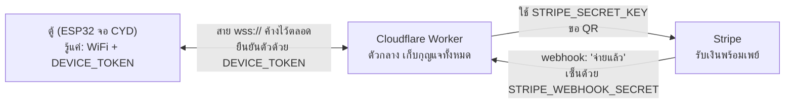

# เริ่มที่นี่: ติดตั้ง QRun Lite สำหรับมือใหม่

[English](start-here.en.md) · **ภาษาไทย**

คู่มือนี้เขียนให้คนที่แฟลช ESP32 เป็นแล้ว แต่ยังไม่คุ้นกับ Cloudflare, Stripe และหน้าต่าง Terminal
ทุกขั้นบอกว่า **ทำอะไร ทำไม พิมพ์อะไร และถ้าสำเร็จจะเห็นอะไร** คุณจะรู้ได้เสมอว่าขั้นนั้นผ่านหรือยัง

อยากได้แบบสั้นสำหรับคนคล่องแล้ว: [deploy.md](deploy.md) · การต่อรีเลย์: [hardware.md](hardware.md)

> [!TIP]
> **ทำไปแล้วบางส่วน?** ดูตารางนี้แล้วกระโดดไปขั้นที่ยังไม่ได้ทำ
>
> | ทำแล้ว | ไปต่อที่ |
> |---|---|
> | ยังไม่ได้ทำอะไรเลย | [เตรียมของ](#3-เตรียมของ) |
> | `wrangler deploy` แล้ว และ `/health` ตอบ `ok` | [ขั้นที่ 5 ใส่ secret](#ขั้นที่-5-ใส่-secret-2-ตัวแรก) |
> | deploy แล้ว + ใส่ secret ครบ 3 ตัวแล้ว | [ขั้นที่ 7 ชี้ firmware ไปที่ Worker แล้วแฟลช](#ขั้นที่-7-ชี้-firmware-ไปที่-worker-แล้วแฟลช) |
> | แฟลชแล้ว จอขึ้น **ออนไลน์** | [เช็คว่าทุกอย่างทำงาน](#5-เช็คว่าทุกอย่างทำงาน) |

## สารบัญ

1. [ภาพรวมใน 1 นาที](#1-ภาพรวมใน-1-นาที)
2. [คำศัพท์ที่ต้องรู้](#2-คำศัพท์ที่ต้องรู้)
3. [เตรียมของ](#3-เตรียมของ)
4. [ขั้นตอนทีละขั้น](#4-ขั้นตอนทีละขั้น) (ขั้นที่ 1–8)
5. [เช็คว่าทุกอย่างทำงาน](#5-เช็คว่าทุกอย่างทำงาน)
6. [เปลี่ยนจาก test เป็นเงินจริง](#6-เปลี่ยนจาก-test-เป็นเงินจริง) และ [สิ่งที่ห้ามทำ](#สิ่งที่ห้ามทำ)
7. [ปัญหาที่พบบ่อย](#7-ปัญหาที่พบบ่อย)

---

## 1. ภาพรวมใน 1 นาที

ระบบมี 3 ชิ้น คุยกันแบบนี้



เล่าเป็นเรื่อง:

1. ลูกค้าแตะปุ่มราคาบนตู้ ตู้บอก Worker ว่า "ขอ QR ฿20"
2. Worker เอากุญแจ Stripe ไปขอ QR พร้อมเพย์ แล้วส่ง QR กลับมาให้ตู้แสดง
3. ลูกค้าสแกนจ่าย Stripe ส่งข้อความ (webhook) มาบอก Worker ว่า "จ่ายแล้ว"
4. Worker ส่งต่อให้ตู้ทันที ตู้บี๊บ แล้วเปิดรีเลย์ตามเวลาที่ตั้งไว้

**ทำไมต้องมี Worker ตรงกลาง?** เพราะเราไม่อยากเก็บกุญแจ Stripe ไว้ในบอร์ด ถ้าตู้ถูกขโมย กุญแจก็ไม่หลุด
บนบอร์ดมีแค่รหัส WiFi กับรหัสผ่านของตู้เอง

### secret ทั้ง 3 ตัว คืออะไร

| ชื่อ | เปรียบเหมือน | อยู่ที่ไหน |
|---|---|---|
| `DEVICE_TOKEN` | **รหัสผ่านของตู้** ตู้ใช้บอก Worker ว่า "ฉันคือตู้ของร้านนี้นะ" ตู้กับ Worker ต้องใช้ค่าเดียวกันเป๊ะ | Worker **และ** `firmware/include/secrets.h` |
| `STRIPE_SECRET_KEY` | **กุญแจบัญชี Stripe** ใครมีกุญแจนี้สั่งสร้างรายการเก็บเงินในชื่อร้านคุณได้ | Worker เท่านั้น ห้ามใส่ในบอร์ด |
| `STRIPE_WEBHOOK_SECRET` | **ลายเซ็นของ Stripe** Worker ใช้เช็คว่าข้อความ "จ่ายแล้ว" มาจาก Stripe จริง ไม่ใช่ใครปลอมมา | Worker เท่านั้น |

นอกจาก secret ยังมี **ค่าตั้งธรรมดา** (ไม่ลับ) อยู่ในไฟล์ เช่น ราคา `PRICE_SATANG` และอีเมลร้าน `RECEIPT_EMAIL`

---

## 2. คำศัพท์ที่ต้องรู้

| คำ | แปลว่า |
|---|---|
| **Terminal** | โปรแกรมพิมพ์คำสั่ง บน Mac เปิดได้จาก Spotlight (⌘ Space) พิมพ์ `Terminal` หรือใช้แท็บ Terminal ใน VS Code ก็ได้ พิมพ์คำสั่งแล้วกด Enter |
| **โฟลเดอร์ที่อยู่ (cd)** | Terminal ทำงานในโฟลเดอร์ใดโฟลเดอร์หนึ่งเสมอ คำสั่ง `cd ชื่อโฟลเดอร์` คือเดินเข้าโฟลเดอร์นั้น `pwd` บอกว่าตอนนี้อยู่ที่ไหน คู่มือนี้บอกทุกครั้งว่าต้องอยู่โฟลเดอร์ไหน |
| **wrangler** | โปรแกรมของ Cloudflare สำหรับสั่งงาน Worker จาก Terminal เราเรียกผ่าน `npx wrangler …` (`npx` = รันโปรแกรมที่ติดตั้งไว้ในโปรเจกต์) |
| **Worker** | โปรแกรมเล็กๆ ที่รันอยู่บนเครื่องของ Cloudflare ตลอด 24 ชั่วโมง คอมพิวเตอร์คุณปิดได้ |
| **deploy** | อัปโหลดโค้ด Worker ขึ้นไปรันบน Cloudflare (เหมือน "แฟลช" แต่แฟลชขึ้นคลาวด์) |
| **secret** | ค่าลับที่ฝากไว้ใน Cloudflare ใส่แล้ว **ดูย้อนหลังไม่ได้** ใส่ทับได้อย่างเดียว ถ้าลืมค่าให้สร้างใหม่แล้วใส่ทับ |
| **webhook** | การที่ Stripe "โทรกลับ" มาหา Worker เองเมื่อมีเหตุการณ์ เช่น ลูกค้าจ่ายแล้ว เราต้องบอก Stripe ว่าให้โทรมาที่ URL ไหน |
| **whsec** | รหัสที่ขึ้นต้นด้วย `whsec_` คือ signing secret ของ webhook แต่ละ endpoint มีของตัวเอง ใช้ข้ามกันไม่ได้ |
| **test mode / live mode** | Stripe มี 2 โลกแยกกัน **test** = เงินปลอม ไว้ลอง กุญแจขึ้นต้น `sk_test_` · **live** = เงินจริง กุญแจขึ้นต้น `sk_live_` กุญแจ webhook และรายการของสองโลกไม่ปนกัน |
| **workers.dev URL** | ที่อยู่เว็บฟรีที่ Cloudflare ให้ Worker เช่น `https://qrun-lite.somchai.workers.dev` (`somchai` คือ subdomain ของบัญชีคุณ) |
| **host** | ส่วนชื่อของ URL อย่างเดียว ไม่มี `https://` และไม่มี `/` ข้างหลัง เช่น `qrun-lite.somchai.workers.dev` |
| **flash (แฟลช)** | คอมไพล์ firmware แล้วเขียนลงบอร์ด ESP32 ผ่านสาย USB |
| **serial monitor** | หน้าต่างที่แสดงข้อความที่บอร์ดพิมพ์ออกมาทางสาย USB ใช้ดูว่าบอร์ดกำลังทำอะไร ต่อ WiFi ได้ไหม ต่อ Worker ได้ไหม |
| **port** | ชื่อช่อง USB ที่บอร์ดเสียบอยู่ บน Mac หน้าตาแบบ `/dev/cu.usbserial-1420` |

---

## 3. เตรียมของ

ติ๊กทีละข้อ แต่ละข้อมีวิธีเช็คว่ามีแล้วจริง

- [ ] **Node.js 20 ขึ้นไป** (ใช้รัน wrangler)
  เช็ค: เปิด Terminal พิมพ์ `node -v` ต้องเห็นเลข `v20.x.x` หรือสูงกว่า
  ถ้าขึ้น `command not found` ให้ติดตั้งจาก https://nodejs.org (เลือกรุ่น LTS)
- [ ] **PlatformIO** (ใช้แฟลชบอร์ด ส่วนเสริม VS Code ก็ได้)
  เช็ค: `~/.platformio/penv/bin/pio --version` ต้องเห็น `PlatformIO Core, version 6.x.x`
- [ ] **บัญชี Cloudflare** (สมัครฟรีที่ https://dash.cloudflare.com)
  เช็ค: ทำในขั้นที่ 3 ด้วย `npx wrangler login` และ `npx wrangler whoami`
- [ ] **บัญชี Stripe ที่จดในประเทศไทย และเปิด PromptPay แล้ว**
  เช็ค: Stripe Dashboard → **Settings → Business details** ประเทศต้องเป็น Thailand
  และ **Settings → Payment methods** ต้องเห็น **PromptPay** เปิดอยู่ (ถ้ายังไม่เปิด ทำในขั้นที่ 1)
- [ ] **บอร์ด ESP32-2432S028R (CYD) + สาย USB ที่ส่งข้อมูลได้** (สายชาร์จอย่างเดียวใช้ไม่ได้)
  เช็ค: เสียบบอร์ดแล้วพิมพ์ `ls /dev/cu.usbserial-*` ต้องเห็นอย่างน้อย 1 บรรทัด
- [ ] **WiFi 2.4 GHz** ที่ตู้จะใช้ (ESP32 ต่อ 5 GHz ไม่ได้)
  เช็ค: ในหน้าตั้งค่าเราเตอร์ หรือดูว่าชื่อ WiFi ไม่ได้ลงท้าย `-5G` ถ้าเราเตอร์รวมสองคลื่นเป็นชื่อเดียว ส่วนใหญ่ใช้ได้
- [ ] **โค้ด QRun Lite อยู่ในเครื่อง** และรู้ว่าอยู่โฟลเดอร์ไหน
  เช็ค: เข้าโฟลเดอร์โปรเจกต์แล้วพิมพ์ `ls` ต้องเห็น `firmware`, `worker`, `docs`, `README.md`

> [!NOTE]
> ในคู่มือนี้ **"root ของโปรเจกต์"** คือโฟลเดอร์ `qrun-lite` ที่มี `firmware/` กับ `worker/` อยู่ข้างใน
> ทุกคำสั่งจะเขียนว่าต้องอยู่ที่ไหน ถ้าหลง ให้ `cd` กลับไปที่ root ก่อนเสมอ

---

## 4. ขั้นตอนทีละขั้น

แต่ละขั้นมี 4 ส่วนเหมือนกัน: **ทำอะไร / ทำไม** → **คำสั่ง** → **ถ้าสำเร็จจะเห็น** → **ถ้าไม่เห็นแบบนั้น**
อย่าไปขั้นต่อไปจนกว่าจะเห็นผลตาม "ถ้าสำเร็จจะเห็น"

### ขั้นที่ 1: เปิด PromptPay และเอากุญแจ test ของ Stripe

**ทำอะไร / ทำไม**
เปิดวิธีรับเงินพร้อมเพย์ใน Stripe แล้วคัดลอกกุญแจโหมดทดสอบมาเตรียมไว้ เราเริ่มจาก test ก่อนเสมอ จะได้ลองจ่ายได้โดยไม่เสียเงินจริง

**คำสั่ง** (ทำในเว็บ ไม่ใช่ Terminal)
1. เข้า https://dashboard.stripe.com แล้วเปิดสวิตช์ **Test mode** (มุมขวาบน บางบัญชีเรียกว่า Sandbox)
2. **Settings → Payment methods** → หา **PromptPay** → กดเปิด
3. **Developers → API keys** → แถว **Secret key** กด **Reveal test key** แล้วคัดลอกไว้ (ยังไม่ต้องวางที่ไหน)

**ถ้าสำเร็จจะเห็น**
- หน้า Payment methods มี PromptPay สถานะเปิด (On / Enabled)
- กุญแจที่คัดลอกขึ้นต้นด้วย `sk_test_`

**ถ้าไม่เห็นแบบนั้น**
- ไม่มี PromptPay ในรายการ: บัญชี Stripe ไม่ได้จดในประเทศไทย ต้องใช้บัญชีไทย
- กุญแจขึ้นต้น `sk_live_`: ยังไม่ได้เปิด Test mode กลับไปเปิดก่อนแล้วคัดลอกใหม่
- กุญแจขึ้นต้น `pk_`: นั่นคือ publishable key ใช้ไม่ได้ ต้องเป็น **Secret** key

> ใช้ restricted key (`rk_test_…`) ที่ให้สิทธิ์แค่ **PaymentIntents: Write** แทนได้ ถ้าหลุดความเสียหายจะน้อยกว่า

---

### ขั้นที่ 2: เช็คราคาและใส่อีเมลร้าน

**ทำอะไร / ทำไม**
ราคาของตู้ถูกเขียนไว้ **2 ที่** ที่ Worker (ตัวคุมว่ารับยอดไหนได้) และที่ firmware (ปุ่มบนจอ) สองค่านี้ต้องเป็นเลขเดียวกัน
และ Stripe บังคับว่าทุกรายการพร้อมเพย์ต้องมีอีเมล จึงต้องใส่อีเมลร้านไว้ที่ Worker

> [!IMPORTANT]
> **ต้องตรงกัน: `PRICE_SATANG`** (หน่วยเป็น **สตางค์** `2000` = ฿20 ขั้นต่ำ `1000` = ฿10)
>
> ```
> worker/wrangler.jsonc              firmware/include/config.h
> "PRICE_SATANG": "2000"   <== ต้องเท่ากัน ==>   PRICE_SATANG = 2000;
>        |                                          |
>   Worker รับเฉพาะยอดนี้                         ตู้ขอยอดนี้ตอนแตะปุ่ม
> ```
> ถ้าไม่เท่ากัน แตะปุ่มทีไรจอขึ้น **เกิดข้อผิดพลาด**

**คำสั่ง** (อยู่ที่ root ของโปรเจกต์)
```bash
grep -n '"PRICE_SATANG"\|"RECEIPT_EMAIL"' worker/wrangler.jsonc
grep -n 'uint32_t PRICE_SATANG\|RUN_SECONDS =' firmware/include/config.h
```
ถ้าจะเปลี่ยนราคาหรืออีเมล ให้เปิดสองไฟล์นี้ใน VS Code แล้วแก้:
- `worker/wrangler.jsonc`: `"PRICE_SATANG"` และ `"RECEIPT_EMAIL"` (ใส่อีเมลร้านของคุณแทน `receipts@example.com`)
- `firmware/include/config.h`: `PRICE_SATANG` (ให้เท่ากับข้างบน) และ `RUN_SECONDS` (รีเลย์ทำงานกี่วินาทีหลังจ่าย)

**ถ้าสำเร็จจะเห็น** (ตัวอย่างค่าเริ่มต้น)
```
14:    "PRICE_SATANG": "2000",
18:    "RECEIPT_EMAIL": "you@yourshop.com"
9:static constexpr uint32_t PRICE_SATANG = 2000;
12:static constexpr uint32_t RUN_SECONDS = 60;
```
ตัวเลข `PRICE_SATANG` ในสองไฟล์ต้องเหมือนกัน และอีเมลต้องเป็นของคุณ

**ถ้าไม่เห็นแบบนั้น**
- ไม่มีอะไรขึ้นเลย: ไม่ได้อยู่ที่ root ของโปรเจกต์ พิมพ์ `pwd` แล้ว `cd` ไปให้ถูก
- แก้ `wrangler.jsonc` หลัง deploy ไปแล้ว: ต้อง deploy ใหม่ (ขั้นที่ 4) ค่าถึงจะมีผล
- แก้ `config.h`: ต้องแฟลชบอร์ดใหม่ (ขั้นที่ 7) ค่าถึงจะมีผล

---

### ขั้นที่ 3: ติดตั้งเครื่องมือและ login Cloudflare

**ทำอะไร / ทำไม**
ติดตั้ง wrangler ลงในโปรเจกต์ แล้วผูก Terminal เข้ากับบัญชี Cloudflare ของคุณ wrangler จะได้รู้ว่าต้อง deploy เข้าบัญชีไหน

**คำสั่ง** (เริ่มที่ root ของโปรเจกต์)
```bash
cd worker
npm install
npx wrangler login
npx wrangler whoami
```
ตอน `wrangler login` browser จะเปิดขึ้นมา ให้กด **Allow** แล้วกลับมาที่ Terminal

**ถ้าสำเร็จจะเห็น**
- `npm install` จบโดยไม่มีคำว่า `ERR!` (มี `warn` ได้ ไม่เป็นไร)
- `wrangler login` ขึ้น `Successfully logged in.`
- `wrangler whoami` ขึ้นประมาณนี้ พร้อมตารางชื่อบัญชี (Account Name) ของคุณ
  ```
  👋 You are logged in with an OAuth Token, associated with the email you@example.com.
  ```

**ถ้าไม่เห็นแบบนั้น**
- `npm: command not found`: ยังไม่ได้ติดตั้ง Node.js กลับไปดู [เตรียมของ](#3-เตรียมของ)
- `You are not authenticated. Please run wrangler login.`: login ไม่สำเร็จ รัน `npx wrangler login` อีกครั้งแล้วกด Allow ใน browser
- browser ไม่เปิดเอง: คัดลอกลิงก์ที่ Terminal พิมพ์ออกมาไปเปิดเอง

---

### ขั้นที่ 4: deploy Worker ขึ้น Cloudflare

**ทำอะไร / ทำไม**
อัปโหลดโค้ด Worker ขึ้นไปรันบน Cloudflare จะได้ URL ถาวรของ Worker มา ตู้และ Stripe จะใช้ URL นี้ติดต่อเข้ามา

> ถ้าบัญชีไม่เคยใช้ Workers มาก่อน ให้เข้า Cloudflare Dashboard → **Workers & Pages** หนึ่งครั้งก่อน เพื่อให้ได้ subdomain `<you>.workers.dev`

**คำสั่ง** (อยู่ในโฟลเดอร์ `worker`)
```bash
npx wrangler deploy
```
จากนั้นทดสอบ (เปลี่ยน `<you>` เป็น subdomain ของคุณ ดูได้จากบรรทัด `https://…` ที่ deploy พิมพ์ออกมา)
```bash
curl https://qrun-lite.<you>.workers.dev/health
```

**ถ้าสำเร็จจะเห็น**
```
Uploaded qrun-lite (x.xx sec)
Deployed qrun-lite triggers (x.xx sec)
  https://qrun-lite.<you>.workers.dev
Current Version ID: …
```
**จด URL บรรทัด `https://…` ไว้** จะใช้อีก 2 ครั้ง (webhook และ firmware)

และ `curl …/health` ตอบคำเดียว:
```
ok
```
(บน Mac อาจเห็นเป็น `ok%` เครื่องหมาย `%` แค่บอกว่าไม่มีขึ้นบรรทัดใหม่ ถือว่าผ่าน)

**ถ้าไม่เห็นแบบนั้น**
- `You need to register a workers.dev subdomain`: เข้า Dashboard → Workers & Pages หนึ่งครั้ง แล้ว deploy ใหม่
- `Could not resolve host` ตอน curl: พิมพ์ host ผิด คัดลอก URL จากผล deploy มาวางทั้งบรรทัด
- `curl` ตอบ `not found`: ลืม `/health` ท้าย URL

---

### ขั้นที่ 5: ใส่ secret 2 ตัวแรก

**ทำอะไร / ทำไม**
ฝากรหัสผ่านของตู้ (`DEVICE_TOKEN`) และกุญแจ Stripe (`STRIPE_SECRET_KEY`) ไว้ใน Worker
ตัวที่ 3 (`STRIPE_WEBHOOK_SECRET`) ยังไม่มี จะได้ในขั้นที่ 6

> [!IMPORTANT]
> **ต้องตรงกัน: `DEVICE_TOKEN`**
>
> ```
> Cloudflare (secret DEVICE_TOKEN)            firmware/include/secrets.h
> 3f9a...c1d2 (48 ตัวอักษร)   <== ต้องเหมือนกันทุกตัว ==>   #define DEVICE_TOKEN "3f9a...c1d2"
> ```
> Cloudflare **ไม่ให้ดูค่า secret ย้อนหลัง** เพราะฉะนั้นให้วางค่าเดียวกันลง `secrets.h` เลยตอนนี้ (ไฟล์นี้ไม่ขึ้น Git)
> จะได้มีที่เก็บค่าไว้

**คำสั่ง** (อยู่ในโฟลเดอร์ `worker`)

5.1 สร้างรหัสผ่านของตู้แบบสุ่ม แล้วคัดลอกลง clipboard ทันที (ไม่ต้องลากคลุมเอง)
```bash
openssl rand -hex 24 | tr -d '\n' | pbcopy
```

5.2 เก็บค่าไว้ในไฟล์ของบอร์ดก่อน: สร้าง `secrets.h` (ถ้ายังไม่มี) แล้วเปิดใน VS Code
```bash
cp -n ../firmware/include/secrets.h.example ../firmware/include/secrets.h
code ../firmware/include/secrets.h
```
(ถ้าคำสั่ง `code` ใช้ไม่ได้ ให้เปิดไฟล์ `firmware/include/secrets.h` จากแถบซ้ายของ VS Code)
แล้ว **วาง (⌘V)** แทนข้อความ `paste-the-same-value-as-the-DEVICE_TOKEN-secret` ในบรรทัด `DEVICE_TOKEN` กด Save
ต้องได้หน้าตาแบบนี้ (มีเครื่องหมาย `"` ครอบ)
```c
#define DEVICE_TOKEN  "3f9a…(รวม 48 ตัว)…c1d2"
```

5.3 ใส่ค่าเดียวกันเข้า Worker (clipboard ยังเป็นค่าเดิมอยู่)
```bash
npx wrangler secret put DEVICE_TOKEN
```
ขึ้น `Enter a secret value:` ให้กด ⌘V แล้ว Enter (ตัวอักษรจะไม่แสดง หรือแสดงเป็น `*` เป็นเรื่องปกติ)

5.4 ใส่กุญแจ Stripe: กลับไปคัดลอก `sk_test_…` จากขั้นที่ 1 แล้ว
```bash
npx wrangler secret put STRIPE_SECRET_KEY
```
วางแล้ว Enter

5.5 ดูรายชื่อ secret ที่มี (แสดงแค่ชื่อ ไม่แสดงค่า)
```bash
npx wrangler secret list
```

**ถ้าสำเร็จจะเห็น**

หลัง 5.3 และ 5.4:
```
🌀 Creating the secret for the Worker "qrun-lite"
✨ Success! Uploaded secret DEVICE_TOKEN
```
```
🌀 Creating the secret for the Worker "qrun-lite"
✨ Success! Uploaded secret STRIPE_SECRET_KEY
```
หลัง 5.5 เห็นชื่อ `DEVICE_TOKEN` และ `STRIPE_SECRET_KEY` ในรายการ

secret มีผลทันที ไม่ต้อง deploy ใหม่

**ถ้าไม่เห็นแบบนั้น**
- `cp: ../firmware/include/secrets.h: File exists` หรือไม่มีอะไรขึ้น: มีไฟล์อยู่แล้ว ไม่เป็นไร เปิดแก้ได้เลย
- ถามว่าจะสร้าง Worker ใหม่ไหม: คุณไม่ได้อยู่ในโฟลเดอร์ `worker` (wrangler หา `wrangler.jsonc` ไม่เจอ) ตอบ **No** แล้ว `cd worker`
- `Success!` ขึ้นเสมอ ต่อให้วางค่าผิด wrangler ไม่ตรวจว่ากุญแจ Stripe ใช้ได้จริง ถ้าวางผิดจะรู้ตอนลองจ่าย
  (ตู้ขึ้น `payment provider error (HTTP 401)`) ให้วางเฉพาะ `sk_test_…` เต็มๆ ไม่มี `"` ไม่มีช่องว่าง
- ไม่แน่ใจว่าวางค่าถูกไหม: ไม่ต้องกลัว ทำ 5.1–5.3 ใหม่ได้เลย ค่าใหม่จะทับค่าเก่า แค่ต้องให้สองที่ตรงกัน

---

### ขั้นที่ 6: ผูก webhook ของ Stripe

**ทำอะไร / ทำไม**
บอก Stripe ว่าเมื่อลูกค้าจ่ายแล้ว ให้ส่งข่าวมาที่ URL ของ Worker แล้วเอารหัสลายเซ็น (`whsec_…`) ของ endpoint นั้นมาใส่ Worker
Worker จะได้เช็คว่าข่าวนั้นมาจาก Stripe จริง
**Lite ไม่มีการถาม Stripe ซ้ำเป็นระยะ** ถ้าไม่ทำขั้นนี้ ตู้จะไม่รู้ว่าลูกค้าจ่ายแล้วจนกว่า QR จะหมดอายุ

> [!IMPORTANT]
> **ต้องตรงกัน: webhook secret ของ endpoint นี้ ในโหมดนี้**
>
> ```
> Stripe (Test mode) endpoint .../stripe/webhook  --whsec_AAA-->  Worker STRIPE_WEBHOOK_SECRET = whsec_AAA
> Stripe (Live mode) endpoint .../stripe/webhook  --whsec_BBB-->  (ใช้ตอนเปลี่ยนเป็นเงินจริง หัวข้อที่ 6)
> ```
> แต่ละ endpoint มี `whsec_` ของตัวเอง ห้ามเอาของ test ไปใช้กับ live และห้ามใช้ `whsec_` ของ `stripe listen`

**คำสั่ง** (ทำในเว็บ Stripe ยังอยู่ใน **Test mode**)
1. Stripe Dashboard → **Developers → Webhooks** → **Add endpoint** (หน้าใหม่อาจชื่อ **Add destination**)
2. **Endpoint URL:** `https://qrun-lite.<you>.workers.dev/stripe/webhook`
3. **Events** เลือก 3 ตัว:
   - `payment_intent.succeeded`
   - `payment_intent.payment_failed`
   - `payment_intent.canceled`
4. กดสร้าง แล้วที่ **Signing secret** กด **Reveal** คัดลอกค่า `whsec_…`
5. ใส่เข้า Worker (อยู่ในโฟลเดอร์ `worker`):
   ```bash
   npx wrangler secret put STRIPE_WEBHOOK_SECRET
   ```

**ถ้าสำเร็จจะเห็น**
```
🌀 Creating the secret for the Worker "qrun-lite"
✨ Success! Uploaded secret STRIPE_WEBHOOK_SECRET
```
และ `npx wrangler secret list` มีครบ 3 ชื่อ: `DEVICE_TOKEN`, `STRIPE_SECRET_KEY`, `STRIPE_WEBHOOK_SECRET`

**ถ้าไม่เห็นแบบนั้น**
- สร้าง endpoint ตอนปิด Test mode: endpoint นั้นเป็นของ live ลบทิ้ง เปิด Test mode แล้วสร้างใหม่
- URL ผิด (ลืม `/stripe/webhook` หรือพิมพ์ host ผิด): แก้ URL ใน Stripe ได้เลย `whsec_` ไม่เปลี่ยน
- เลือก event ไม่ครบ 3 ตัว: กด **Edit** ที่ endpoint แล้วเพิ่ม

---

### ขั้นที่ 7: ชี้ firmware ไปที่ Worker แล้วแฟลช

**ทำอะไร / ทำไม**
บอกบอร์ดว่า Worker อยู่ที่ไหน และใช้รหัสผ่านอะไร จากนั้นเขียน firmware ลงบอร์ด
หลังขั้นนี้ ตู้จะต่อเข้า Worker เองทุกครั้งที่เปิดเครื่อง

> [!IMPORTANT]
> **ต้องตรงกัน 2 ค่า**
>
> ```
> ผล wrangler deploy:  https://qrun-lite.somchai.workers.dev
>                              |  (ตัด https:// ออก)
>                              v
> secrets.h:           #define WS_HOST  "qrun-lite.somchai.workers.dev"
>
> secret DEVICE_TOKEN (ขั้นที่ 5)  <== ค่าเดียวกัน ==>  #define DEVICE_TOKEN "…"
> ```

**7.1 แก้ `firmware/include/secrets.h`** (เปิดใน VS Code เหมือนขั้นที่ 5.2)

| บรรทัด | ใส่อะไร | ตัวอย่าง |
|---|---|---|
| `WIFI_SSID` | ชื่อ WiFi 2.4 GHz ตรงตัวพิมพ์เล็กใหญ่ | `"MyShop_2.4G"` |
| `WIFI_PASS` | รหัส WiFi | `"12345678"` |
| `WS_HOST` | host ของ Worker **ไม่มี `https://` ไม่มี `/` ท้าย** | `"qrun-lite.somchai.workers.dev"` |
| `WS_PORT` | `443` | `443` |
| `WS_USE_TLS` | `1` (เข้ารหัส) | `1` |
| `DEVICE_ID` | ชื่อตู้อะไรก็ได้ ใช้แสดงใน log | `"kiosk-01"` |
| `DEVICE_TOKEN` | ค่าเดียวกับ secret `DEVICE_TOKEN` | `"3f9a…c1d2"` |

เสร็จแล้วไฟล์ควรหน้าตาแบบนี้ (ค่าของคุณเอง):
```c
#define WIFI_SSID     "MyShop_2.4G"
#define WIFI_PASS     "12345678"

#define WS_HOST       "qrun-lite.somchai.workers.dev"
#define WS_PORT       443
#define WS_USE_TLS    1

#define DEVICE_ID     "kiosk-01"
#define DEVICE_TOKEN  "3f9a…c1d2"
```
กด Save

> [!WARNING]
> **จำค่า `DEVICE_TOKEN` ไม่ได้แล้ว?** (เช่น ใส่ secret ไปแล้วแต่ไม่ได้เก็บไว้) Cloudflare ดูย้อนหลังไม่ได้
> ให้ทำขั้นที่ 5.1–5.3 ใหม่: สร้างค่าใหม่ วางใน `secrets.h` แล้ว `npx wrangler secret put DEVICE_TOKEN` ทับ

**7.2 หา port ของบอร์ด**

ถอดสาย USB ของบอร์ดออกก่อน แล้วพิมพ์
```bash
ls /dev/cu.*
```
จากนั้นเสียบบอร์ด แล้วพิมพ์คำสั่งเดิมอีกครั้ง **บรรทัดที่เพิ่มขึ้นมาคือ port ของบอร์ด** ปกติหน้าตาแบบ
```
/dev/cu.usbserial-1420
```
(บางเครื่องเป็น `/dev/cu.wchusbserial…` ใช้ได้เหมือนกัน เลขเปลี่ยนตามช่อง USB ที่เสียบ)

**7.3 แฟลช** (เริ่มที่ root ของโปรเจกต์ เปลี่ยน `XXXX` เป็นเลข port ของคุณ)
```bash
cd firmware
~/.platformio/penv/bin/pio run -t upload --upload-port /dev/cu.usbserial-XXXX
```
ครั้งแรกจะนานหน่อย (ดาวน์โหลด toolchain และ library)

**ถ้าสำเร็จจะเห็น** ท้ายๆ ของผลลัพธ์
```
Writing at 0x000… (100 %)
Wrote … bytes (… compressed) at 0x00010000 in … seconds …
Hash of data verified.

Leaving...
Hard resetting via RTS pin...
========================= [SUCCESS] Took … seconds =========================
```
บอร์ดจะรีสตาร์ตเอง จอขึ้น **QRun Lite** มุมขวาบนขึ้นสถานะ

**ถ้าไม่เห็นแบบนั้น**
- `Missing include/secrets.h: copy include/secrets.h.example …`: ยังไม่มีไฟล์ `secrets.h` ทำขั้นที่ 5.2
- `port is busy` / `Resource busy` / `Could not open /dev/cu.usbserial-…`: มีโปรแกรมอื่นเปิด port อยู่
  (serial monitor ใน VS Code, Arduino IDE, Terminal อีกหน้าต่าง) ปิดให้หมดแล้วแฟลชใหม่
- `Failed to connect to ESP32` หรือค้างที่ `Connecting....`: สายเป็นสายชาร์จอย่างเดียว หรือ port ผิด
  ลองสายอื่น หรือกดปุ่ม **BOOT** ค้างไว้ตอนขึ้น `Connecting…` แล้วปล่อย
- คอมไพล์ error ที่บรรทัดใน `secrets.h`: มักเป็นเครื่องหมาย `"` หาย หรือกลายเป็น `“ ”` (อัญประกาศโค้ง) ให้พิมพ์ `"` ใหม่ใน VS Code

---

### ขั้นที่ 8: ดู serial ว่าตู้ต่อ Worker ได้

**ทำอะไร / ทำไม**
เปิดหน้าต่างอ่านข้อความจากบอร์ด เพื่อยืนยันว่าบอร์ดต่อ WiFi ได้ ต่อ Worker ได้ และ Worker ยอมรับรหัสผ่าน

**คำสั่ง** (อยู่ในโฟลเดอร์ `firmware` ปิดหน้าต่างอื่นที่เปิด port อยู่ก่อน)
```bash
~/.platformio/penv/bin/pio device monitor --port /dev/cu.usbserial-XXXX
```
ถ้าไม่เห็นบรรทัดแรกๆ ให้กดปุ่ม **RST** (หรือ EN) บนบอร์ดหนึ่งครั้ง จะได้เห็นตั้งแต่เริ่ม · ออกจาก monitor ด้วย **Ctrl+C**

**ถ้าสำเร็จจะเห็น** ตามลำดับนี้
```
[QRun Lite] lite-1.0.0, price 2000 satang, run 60 s -> wss://qrun-lite.<you>.workers.dev:443
[WIFI] connected, IP 192.168.1.23
[WS] connected
[WS] > {"t":"hello","fw":"lite-1.0.0"}
[WS] < {"t":"hello","device":"kiosk-01","live":false}
```
| บรรทัด | แปลว่า |
|---|---|
| `[QRun Lite] … -> wss://…:443` | บอร์ดบูตแล้ว และจะต่อไปที่ host นี้ เช็คว่า host ถูก |
| `[WIFI] connected, IP …` | ต่อ WiFi ได้ |
| `[WS] connected` | ต่อ Worker ได้ **และรหัสผ่านตู้ถูก** |
| `[WS] < {"t":"hello",…,"live":false}` | Worker ทักกลับ `live:false` = ใช้กุญแจ test |

บนจอ มุมขวาบนขึ้น **ออนไลน์** จุดเขียว และมีป้าย **TEST** สีเหลืองตรงกลาง


**ถ้าไม่เห็นแบบนั้น**
- ขึ้น `[WIFI] status=1` ซ้ำๆ และจอขึ้น **ไม่มี WiFi** จุดแดง: หา WiFi ไม่เจอ (เป็น 5 GHz หรือชื่อผิด) แก้ `WIFI_SSID` แล้วแฟลชใหม่
- ขึ้น `[WIFI] status=4`: รหัส WiFi ผิด
- ถึง `[WIFI] connected` แล้วเงียบ ไม่มี `[WS] connected` จอค้าง **กำลังเชื่อมต่อ** จุดเหลือง:
  ส่วนใหญ่ `DEVICE_TOKEN` ไม่ตรงกัน (Worker ตอบ 401) หรือ `WS_HOST` ผิด ดูวิธีแยกใน [ปัญหาที่พบบ่อย](#7-ปัญหาที่พบบ่อย)
- ตัวอักษรเป็นขยะอ่านไม่ออก: ความเร็วไม่ตรง ให้รัน monitor จากในโฟลเดอร์ `firmware` (ตั้งไว้ 115200)

 

---

## 5. เช็คว่าทุกอย่างทำงาน

ใช้ Terminal 2 หน้าต่าง: หน้าต่างแรกเปิด serial monitor (ขั้นที่ 8) หน้าต่างที่สองเปิด log ของ Worker

- [ ] **Worker ตอบ** `curl https://qrun-lite.<you>.workers.dev/health` → `ok`
- [ ] **ตู้ทัก Worker** serial มี `[WS] connected` และ `{"t":"hello",…}` จอขึ้น **ออนไลน์** + **TEST**
- [ ] **เปิด log ของ Worker** (หน้าต่างที่ 2 อยู่ในโฟลเดอร์ `worker`)
  ```bash
  npx wrangler tail --format pretty
  ```
  ต้องขึ้น `Connected to qrun-lite, waiting for logs...` เปิดค้างไว้
- [ ] **ลองจ่ายในโหมด test**
  1. แตะปุ่มราคาบนตู้ → จอขึ้น QR พร้อมนับถอยหลัง และป้าย TEST
  2. สแกน QR ด้วย **กล้องมือถือธรรมดา** (ไม่ใช่แอปธนาคาร) → จะเปิดหน้าเว็บทดสอบของ Stripe
  3. กด **Authorize** (อนุมัติการจ่ายทดสอบ)
  4. ตู้ต้อง **บี๊บ** ขึ้น **กำลังทำงาน** นับถอยหลัง และรีเลย์ติดทันที ครบเวลาแล้วกลับหน้าปุ่ม

   

  serial จะขึ้นประมาณ
  ```
  [WS] > {"t":"create","amount":2000,"ref":"…"}
  [WS] < {"t":"payment","pi":"pi_…","ref":"…","amount":2000,"qr":"…","expires":…}
  [RUN] pi_…: relay on for 60 s
  [WS] < {"t":"status","pi":"pi_…","status":"succeeded","amount":2000,"ref":"…"}
  [RUN] done
  ```
  `wrangler tail` จะขึ้น (อาจมีบรรทัดอื่นแทรก)
  ```
  POST https://qrun-lite.<you>.workers.dev/stripe/webhook - Ok @ …
    (log) created pi_… ref=… amount=2000
    (log) pi_… succeeded (delivered)
  ```
- [ ] **ลองกรณีจ่ายไม่ผ่าน** ทำซ้ำแต่กด **Fail** ตู้ต้องขึ้น **ชำระเงินไม่สำเร็จ** และรีเลย์ไม่ติด
- [ ] **ดูใน Stripe Dashboard** (Test mode)
  - **Payments**: เห็นรายการ ฿20 สถานะ Succeeded
  - **Developers → Webhooks → endpoint ของเรา**: การส่งล่าสุดเป็น **200** (ถ้าเป็น 400 ดู [ปัญหาที่พบบ่อย](#7-ปัญหาที่พบบ่อย))

ครบทุกข้อ = ระบบพร้อม ตู้ทำงานได้เองโดยไม่ต้องเปิดคอมพิวเตอร์ ปิด Terminal ได้เลย (กด Ctrl+C เพื่อหยุด tail และ monitor)

---

## 6. เปลี่ยนจาก test เป็นเงินจริง

**อะไรเปลี่ยน:** แค่ secret 2 ตัวใน Worker ไม่ต้อง deploy ใหม่ ไม่ต้องแฟลชบอร์ด `DEVICE_TOKEN` ใช้ค่าเดิม

| ของ | test (ตอนนี้) | live (เงินจริง) |
|---|---|---|
| `STRIPE_SECRET_KEY` | `sk_test_…` | `sk_live_…` (หรือ `rk_live_…`) ใหม่ |
| webhook endpoint | endpoint ใน Test mode | **สร้าง endpoint ใหม่ใน Live mode** URL และ events เหมือนเดิม |
| `STRIPE_WEBHOOK_SECRET` | `whsec_` ของ endpoint test | `whsec_` **ของ endpoint live ตัวใหม่** |
| `DEVICE_TOKEN` | เดิม | เดิม |

ขั้นตอน
1. Stripe Dashboard **ปิด Test mode** → Developers → API keys → คัดลอก Secret key (`sk_live_…`)
2. ยังอยู่ใน Live mode: Developers → Webhooks → **Add endpoint** URL `https://qrun-lite.<you>.workers.dev/stripe/webhook`
   events 3 ตัวเดิม → Reveal signing secret → คัดลอก `whsec_…` ตัวใหม่
3. ใส่ทับ (อยู่ในโฟลเดอร์ `worker`)
   ```bash
   npx wrangler secret put STRIPE_SECRET_KEY        # วาง sk_live_…
   npx wrangler secret put STRIPE_WEBHOOK_SECRET    # วาง whsec_ ของ endpoint live
   ```
4. กดปุ่ม RST บนบอร์ด serial ต้องขึ้น `"live":true` และป้าย **TEST** บนจอหายไป
5. ลองจ่ายจริงด้วยแอปธนาคาร ฿20 หนึ่งครั้ง แล้วดูใน Stripe (Live) ว่า webhook เป็น 200

> ถ้าอยากกลับไป test: ใส่ `sk_test_…` และ `whsec_` ของ endpoint test กลับเข้าไป (สองตัวต้องมาคู่กันเสมอ)

### สิ่งที่ห้ามทำ

- **ห้ามวางกุญแจหรือ secret ในแชท** (LINE, Discord, AI chat, issue บน GitHub) และห้าม commit ขึ้น Git
  ถ้าเผลอ ให้ Stripe Dashboard → API keys → **Roll key** แล้ว `npx wrangler secret put STRIPE_SECRET_KEY` ใหม่
- **ห้ามใส่กุญแจ Stripe ใน firmware** บอร์ดมีได้แค่ WiFi และ `DEVICE_TOKEN` เท่านั้น
- **ห้ามใช้ `whsec_` ของ test กับ live** (และห้ามใช้ของ `stripe listen`) แต่ละ endpoint มีของตัวเอง
- **ห้าม commit `firmware/include/secrets.h` และ `worker/.dev.vars`** สองไฟล์นี้อยู่ใน `.gitignore` แล้ว อย่าลบออก
- **อย่าใช้ `DEVICE_TOKEN` สั้นๆ ที่คิดเอง** ใช้ `openssl rand -hex 24` เสมอ ถ้าตู้หายหรือ token หลุด ให้สร้างใหม่ ใส่ทับ แล้วแฟลชใหม่

---

## 7. ปัญหาที่พบบ่อย

เปิด serial (ขั้นที่ 8) กับ `npx wrangler tail --format pretty` พร้อมกัน แล้วหาอาการในตาราง

| อาการ | สาเหตุ | วิธีแก้ |
|---|---|---|
| ตู้ **ออนไลน์** ปกติ (มี `[WS] connected` และ hello) แต่แตะปุ่มราคาปุ๊บขึ้น **เกิดข้อผิดพลาด** serial ขึ้น `[ERR] payment provider error (HTTP 401)` และ `[WS] < {"t":"error","ref":"…","msg":"payment provider error (HTTP 401)"}` | `STRIPE_SECRET_KEY` ใน Worker ผิด: ไม่ใช่ Secret key `sk_test_…`/`sk_live_…` เช่น เผลอวาง publishable key `pk_…`, วาง `whsec_…`, คัดลอกมาไม่ครบ, มี `"` หรือช่องว่างติดมา หรือเป็นกุญแจของบัญชี Stripe อื่น | Stripe Dashboard → (Test mode) **Developers → API keys** → Secret key → **Reveal** → คัดลอกทั้งหมด → `cd worker && npx wrangler secret put STRIPE_SECRET_KEY` วาง **เฉพาะตัวกุญแจ** มีผลในไม่กี่วินาที **ไม่ต้องแฟลชใหม่** แล้วแตะปุ่มอีกครั้ง · `npx wrangler tail --format pretty` จะเห็นบรรทัด `(log) create … failed: HTTP 401 …` พร้อมข้อความจาก Stripe (กุญแจถูกปิดบังไว้) |
| จอขึ้น **กำลังเชื่อมต่อ** ค้าง serial ถึง `[WIFI] connected` แล้วไม่มี `[WS] connected` และ tail ขึ้น `(log) ws auth rejected` | **401 ที่ /ws**: `DEVICE_TOKEN` ใน `secrets.h` ไม่ตรงกับ secret | ทำขั้นที่ 5.1–5.3 ใหม่ให้สองที่เป็นค่าเดียวกัน แล้วแฟลช (ขั้นที่ 7.3) |
| เหมือนข้างบน แต่ tail ไม่มีอะไรขึ้นเลย | `WS_HOST` ผิด (มี `https://` หรือ `/` ติดมา สะกดผิด) หรือเครือข่ายบล็อก | เทียบกับ URL ตอน deploy, ลอง `curl https://<host>/health` |
| tail ขึ้น `(log) DEVICE_TOKEN secret is not set` | ยังไม่ได้ใส่ secret `DEVICE_TOKEN` | ขั้นที่ 5.3 |
| จอขึ้น **ไม่มี WiFi** จุดแดง serial ขึ้น `[WIFI] status=1` | หา WiFi ไม่เจอ: เป็น 5 GHz อย่างเดียว หรือชื่อ SSID ผิด (ตัวพิมพ์เล็กใหญ่มีผล) | ใช้ WiFi 2.4 GHz แก้ `WIFI_SSID` แล้วแฟลช |
| serial ขึ้น `[WIFI] status=4` | รหัส WiFi ผิด | แก้ `WIFI_PASS` แล้วแฟลช |
| Stripe → Webhooks ขึ้น **400** tail ขึ้น `(log) webhook rejected: bad signature` | `STRIPE_WEBHOOK_SECRET` ไม่ใช่ของ endpoint นี้ในโหมดนี้ | คัดลอก `whsec_` จาก endpoint ที่ถูก (โหมดเดียวกับกุญแจ) แล้ว `secret put STRIPE_WEBHOOK_SECRET` |
| tail ขึ้น `webhook rejected: STRIPE_WEBHOOK_SECRET is not set` | ยังไม่ได้ใส่ secret ตัวที่ 3 | ขั้นที่ 6 |
| จ่ายแล้ว แต่ตู้ไม่เปลี่ยน จนนับถอยหลังหมดแล้วค่อยขึ้นผล | webhook ไม่เข้า (ไม่ได้สร้าง, URL ผิด, events ไม่ครบ, whsec ผิด) **Lite ไม่มีการถามซ้ำ** จะรู้ผลตอน QR หมดอายุหรือตอนตู้ต่อใหม่ | ทำขั้นที่ 6 ให้ถูก เงินไม่หาย Worker เช็คกับ Stripe ตอน QR หมดอายุ |
| แตะปุ่มแล้วขึ้น **เกิดข้อผิดพลาด** serial ขึ้น `[ERR] amount not allowed` | ราคาไม่ตรงกัน: `PRICE_SATANG` ใน `wrangler.jsonc` ≠ `config.h` | แก้ให้เท่ากัน แล้ว deploy + แฟลช (ขั้นที่ 2) |
| แตะปุ่มแล้วขึ้น **เกิดข้อผิดพลาด** serial ขึ้น `[ERR] payment provider error (…)` ที่ไม่ใช่ `HTTP 401` | ยังไม่เปิด PromptPay, บัญชีไม่ใช่ไทย, กุญแจผิด หรือ `RECEIPT_EMAIL` ว่าง | ขั้นที่ 1 และ 2 ดูรายละเอียดใน tail บรรทัด `create … failed` |
| แฟลชไม่ได้ ขึ้น `port is busy` / `Resource busy` | serial monitor หรือโปรแกรมอื่นเปิด port อยู่ | ปิด monitor (Ctrl+C) และโปรแกรมอื่นที่ใช้ port แล้วแฟลชใหม่ |
| บอร์ดรีสตาร์ตเองตอนเปิดโปรแกรม หรือ serial ขาดๆ หายๆ | มี 2 โปรแกรมเปิด port เดียวกัน (การเปิด port สั่งรีเซ็ต ESP32) | ใช้ทีละโปรแกรม เช่น ปิด monitor ใน VS Code ถ้าใช้ monitor ใน Terminal |
| คอมไพล์ขึ้น `Missing include/secrets.h` | ยังไม่ได้สร้าง `secrets.h` | ขั้นที่ 5.2 |
| รีเลย์ทำงานกลับด้าน (ติดตอนว่าง ดับตอนจ่าย) | บอร์ดรีเลย์เป็นแบบ low-trigger | `RELAY_ACTIVE_HIGH = false` ใน `config.h` แล้วแฟลช ดู [hardware.md](hardware.md) |
| แตะไม่ตรงปุ่ม หรือสีเพี้ยน | รุ่นย่อยของบอร์ด CYD | ดูหัวข้อ CYD variants ใน [hardware.md](hardware.md) |

ยังไม่เจอ: เทียบข้อความใน serial และ tail กับ [PROTOCOL.md](../PROTOCOL.md) หรือดูตารางแก้ปัญหาแบบละเอียดใน [deploy.md](deploy.md#แก้ปัญหา)

---

## งานดูแลที่ทำบ่อย

| อยากทำอะไร | ทำอย่างไร |
|---|---|
| เปลี่ยนราคา | แก้ `PRICE_SATANG` ทั้ง `worker/wrangler.jsonc` และ `firmware/include/config.h` → `cd worker && npx wrangler deploy` → แฟลช |
| เปลี่ยนเวลารีเลย์ | แก้ `RUN_SECONDS` ใน `config.h` → แฟลช |
| ย้ายตู้ไป WiFi ใหม่ | แก้ `WIFI_SSID` / `WIFI_PASS` ใน `secrets.h` → แฟลช |
| อัปเดตโค้ด Worker | `cd worker && npm test && npx wrangler deploy` |
| ย้อนกลับ Worker เวอร์ชันก่อน | `cd worker && npx wrangler rollback` |
| ดูว่ามี secret อะไร (ไม่แสดงค่า) | `cd worker && npx wrangler secret list` |
